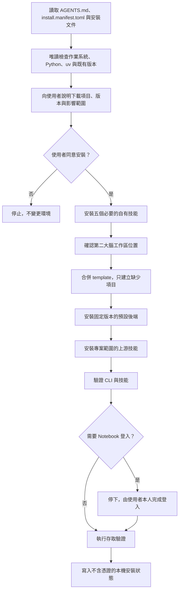

# 交給 AI Agent 的安裝入口

本文件是 `My Real Second Brain` 的人類可讀安裝入口；`install.manifest.toml` 是機器可讀入口。使用者不需要分別前往 Graphify 與 `notebooklm-py` 下載；AI Agent 應依 manifest 安裝五個自有技能與固定版本的預設後端，並保留未來替換後端的能力。

## 安裝流程

## Agent 執行規則

1. 先讀取 `docs/installation.md`、`docs/client-compatibility.md` 與 `docs/providers.md`。
2. 技能清單、來源路徑、安裝範圍、provider 版本與順序，一律來自 `install.manifest.toml`。
3. 下載、安裝、覆蓋既有工具或開啟登入流程前，先取得使用者同意。
4. 預設使用套件管理器安裝正式發行版，不 clone 上游 repository。
5. 五個自有技能預設安裝於使用者範圍；上游技能預設安裝於專案範圍。
6. 先確認使用者指定的工作區，再把 `template/` 合併進去；只建立缺少項目，任何同名衝突都先停止詢問。
7. 上游技能視為可以重新產生的依賴，不混入本專案自行維護的 `skills/`。
8. Notebook 登入由使用者本人完成；不得讀取或保存其憑證。
9. 驗證失敗時停止並回報，不自動刪除既有環境或資料。

完整命令與驗證標準請見 `docs/installation.md`。
