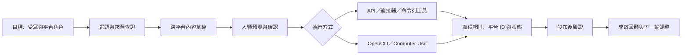

# AI Workflow Toolbox

> 提供給一人公司創業者的 AI 工作流工具包，協助一個人完成內容、營運、知識管理、社群經營與官網建置。

AI Workflow Toolbox 是一個專為一人公司創業者（solopreneur）設計、規劃以開放原始碼方式發布的工具包。它會把一人公司經營時常見的重要工作，整理成一系列 AI Agent（能依步驟執行任務的 AI 助理）技能包，讓使用者可以在缺少完整團隊的情況下，仍然有方法地完成工作並檢查成果。

本專案預計支援下列桌面端與開發工具：

- OpenAI ChatGPT／Codex 桌面端
- Anthropic Claude Desktop／Claude Code
- Google Antigravity

不同用戶端能使用的工具、技能安裝位置與權限模型並不完全相同。本專案會盡量共用同一份工作流程核心，再為各用戶端提供個別的安裝入口與相容層，不會假設一份設定可以直接套用到所有環境。

> [!IMPORTANT]
> 本專案目前處於早期開發階段。AI 知識庫已收錄第一個完整套件；Codex、Claude Code 與 Antigravity Desktop 的專案規則及本機 symlink 技能入口已實測。全新環境安裝與 Provider 登入仍待端到端驗收。其餘四套技能包尚未完成，也尚未公開發布本 repository。

## 專案要解決的問題

一人公司通常沒有分工完整的影片團隊、營運人員、知識管理人員、社群團隊與網站團隊。創業者必須同時處理產品或服務、內容行銷、日常營運、顧客溝通與自己的數位資產，但可用的時間、預算與專業能力都有限。

AI 工具可以協助處理其中一部分工作，但只有工具還不夠。使用者仍然需要知道應該從哪裡開始、要提供什麼資料、哪些步驟可以交給 AI、哪些決定必須自己做，以及如何判斷結果真的能投入使用。

AI Workflow Toolbox 要提供一套一人公司可以實際採用的創業工具包，協助使用者完成五項核心能力：

1. 把原始素材製作成可以發布的影片。
2. 使用 Google 工具建立日常營運自動化。
3. 建立能支援學習、研究、寫作與決策的 AI 知識庫。
4. 建立並執行自己的社群媒體管理方法。
5. 建立、上線並持續維護自己的官方網站。

本專案不是只提供零散提示詞，也不是要用 AI 取代創業者的判斷。每套技能都要從實際經營需求出發，引導使用者完成規劃、準備、執行、確認與成果驗收。

## 五大技能包

| 技能包 | 目前狀態 | 第一階段目標 |
|---|---|---|
| AI 剪片工作流 | 既有能力分散在 `video-use` 與內容製作技能中，待盤點與拆分 | 從素材盤點、轉錄、剪輯、字幕、動畫到最終品質檢查，建立可恢復且有人工確認點的完整流程 |
| Google 工具自動化 | [Learn-GAS](https://github.com/iamraven-tw/Learn-GAS) 已獨立公開；Google Cloud 工作流尚待設計 | 保留 Apps Script 初學者路線，補上 Workspace API、OAuth 與 Google Cloud 應用的實際案例 |
| AI 知識庫 | 已收錄完整套件並通過三種用戶端的規則與本機技能入口驗證；全新安裝仍待驗收 | 建立以人類理解與一人公司長期設定為核心的知識擷取、整理、檢索、引用、討論與知識圖譜流程 |
| 社群媒體管理工作流 | 有個人化實驗與自動化經驗，但公開版本需要重新設計 | 引導使用者先建立社群策略，再完成跨平台內容、審核、發布、驗證與成效回顧 |
| 官網打造工作流 | 尚待設計 | 從商業目標、網站架構、文案與設計開始，完成開發、網域、部署、成效追蹤與後續維護 |

### 1. AI 剪片工作流

這套技能包預計涵蓋：

- 素材盤點與來源保護
- 語音轉文字、逐字稿校正與時間軸對齊
- 內容剪輯、停頓與口誤處理
- 橫式長片、直式短片與螢幕教學的不同製作路線
- 字幕、章節、動態文字、圖卡、A-roll 與 B-roll
- 音訊、畫面、字幕與輸出規格檢查
- 人工觀看／聆聽驗收與交付狀態記錄

第一輪工作會先盤點既有的 `video-use` 與內容製作技能，區分：

1. 可供所有人重複使用的剪片能力。
2. 特定創作者、品牌或節目才需要的規則。
3. 必須保留上游授權與出處的第三方程式。
4. 尚未通過真實影片驗證的實驗功能。

### 2. Google 工具自動化

[Learn-GAS](https://github.com/iamraven-tw/Learn-GAS) 已經提供 Google Apps Script 的教學、專案開發、除錯與固定版面技能。本專案不會直接複製它並造成兩份來源，而會先決定它應該保持獨立依賴、成為子專案，或只由本工具箱提供安裝與分流入口。

Google Cloud 路線會從使用者故事（User Story，也就是使用者真正想完成的工作）出發，而不是先教一整套雲端產品。初步案例包括：

- **需要穩定公開入口的自動化：** 接收表單、付款或其他服務的 Webhook，再安全寫入 Google Sheets、Drive 或 Gmail 流程。
- **超出 Apps Script 執行限制的工作：** 把耗時的資料處理放到 Cloud Run，透過 Cloud Scheduler 定時執行，並留下可檢查的紀錄。
- **多人使用的 Google 應用：** 建立 OAuth 同意畫面、測試使用者、最小權限與安全的憑證保存方式。
- **Google Workspace 外掛：** 從 Gmail、Docs 或 Sheets 介面啟動一段明確、可驗收的工作流程。
- **事件驅動的文件處理：** 新檔案進入指定位置後，自動分類、轉換、通知與記錄，並避免重複處理。

每個案例都必須說清楚：為什麼 Apps Script 不足、為什麼需要 Google Cloud、可能產生的費用、需要哪些權限，以及使用者如何判斷成果真的可用。

### 3. AI 知識庫

這套技能包會以 [My Real Second Brain](https://github.com/iamraven-tw/My-Real-Second-Brain) 的核心原則為基礎：AI 負責保存、整理、連結、檢索與提醒，但閱讀、理解、判斷和選擇仍由人類負責。

預計拆分的能力包括：

- 第一次沒有明確任務時，逐步建立一人公司設定檔
- 用口說或文字記錄自己的想法與讀書心得
- 保存外部來源，同時保留作者、網址、時間與引用
- 區分使用者自己的理解、外部事實與 AI 推論
- 搜尋本機知識、雲端 Notebook 與網路資料
- 透過一問一答檢查假設、找出反方觀點並形成共同理解
- 建立知識頁、索引與可重建的知識圖譜
- 控制哪些資料可以上傳、哪些資料只能留在本機

個人筆記、私人研究資料與帳號內容不會因為整合技能而公開。

完整套件位於 [`skill-packs/ai-knowledge-base/`](skill-packs/ai-knowledge-base/README.md)，其中包含五個自有技能、空白工作區範本、安裝 manifest、Provider 契約與 repository 驗證程式。這份目錄不需要連回維護者的其他本機專案即可使用。

### 4. 社群媒體管理工作流

社群媒體技能包不只負責「幫我發一篇貼文」。它要先引導使用者建立自己的管理方法：

- 經營目標、受眾與平台角色
- 內容主題、資料來源與查證標準
- 各平台的文案、圖片與影片規格
- 編輯、審核、排程與發布規則
- 留言、私訊與社群互動邊界
- 貼文網址、平台 ID、發布時間與失敗狀態記錄
- 各平台自己的比較基準與定期回顧方法

第一階段預計涵蓋：

- Facebook、Instagram、Threads 的 Meta 平台工作流
- X 的內容搜尋、名單管理、互動與發布工作流
- Substack 文章與 Notes 的準備、發布與驗證工作流

預設的執行順序是：

1. 優先使用平台正式提供且符合使用情境的 API。
2. 其次使用可驗證的官方連接器或命令列工具。
3. API 不存在、權限不足或不適合時，才透過 OpenCLI 操作使用者已登入的瀏覽器。
4. 只有需要畫面判斷、而且前述方法不可行時，才使用 Computer Use。
5. 若自動化風險過高或無法可靠驗證，就停在預覽階段，交由使用者手動完成。



### 5. 官網打造工作流

一人公司的官網不應該只是技術展示，也不一定需要一開始就做成龐大的網站。它首先要讓訪客清楚知道：這家公司服務誰、提供什麼產品或服務、為什麼值得信任，以及下一步可以採取什麼行動。

這套技能包預計涵蓋：

- 釐清商業目標、目標客群與網站任務
- 規劃首頁、關於、服務／產品、案例、內容與聯絡頁面
- 撰寫網站文案、價值主張與行動呼籲
- 建立視覺方向、設計系統、行動裝置版面與無障礙基礎
- 根據預算、技術能力與維護成本選擇合適的網站方案
- 串接表單、電子報、預約、付款或其他必要服務
- 設定網域、搜尋引擎最佳化、流量分析與基本隱私說明
- 完成測試、部署、備份、監控與後續內容更新

第一階段會先以一人公司最常需要的最小可用官網為範圍：能清楚介紹業務、建立信任、收集潛在顧客，並提供明確的聯絡或購買入口。AI 可以協助規劃、撰寫、設計與開發，但網域購買、付費服務、正式部署與公開發布仍需要使用者明確確認。

## 共用設計原則

### 一個人也能長期維護

每套工作流都要考慮一人公司的時間、預算與維護能力。預設先提供能真正運作的最小方案，再依需求擴充；不為了技術完整而引入使用者無法長期管理的複雜系統。

### 使用者故事優先

每個技能必須先回答「誰要完成什麼工作」以及「使用者怎麼看得出成功」，再選擇 API、程式或瀏覽器操作方式。

### 共用核心，不複製三份流程

工作流程、確認關卡、參考資料與測試盡量只保留一份。ChatGPT／Codex、Claude 與 Antigravity 的入口檔案只處理安裝、工具差異和用戶端特有設定。

### API 優先，瀏覽器是受控備援

瀏覽器操作比較容易受到登入狀態、版面改動與彈出視窗影響。需要使用瀏覽器時，技能必須先確認帳號、目標、可見預覽與停止條件，完成後再讀回結果，而不是只相信按鈕已經被點擊。

### 準備、執行與驗證分開

產生草稿不代表已發布；建立本機檔案不代表已上傳；按下按鈕也不代表平台已接受。每個工作流都要分開記錄：

1. 已準備的內容。
2. 使用者已確認的範圍。
3. 實際執行的外部操作。
4. 從平台或輸出檔讀回的驗證結果。

### 高影響操作需要明確確認

下列操作預設不得由「幫我處理」這類模糊指令自動推定：

- 發布、排程、寄信或傳送訊息
- 部署、推送遠端程式或建立公開連結
- 刪除、覆寫或大量修改資料
- 使用可能計費的 API、模型或雲端資源
- 變更帳號權限、OAuth 範圍或安全設定

### 私密資料不進入儲存庫

不得提交 API 金鑰、Token、Cookie、工作階段、OAuth 憑證、私人資源 ID、真實帳號資料或個人內容。公開範例只能使用假資料、範例設定與 `.env.example` 類型的欄位說明。

### 可以中斷，也能恢復

需要多階段處理的技能應保存不含敏感資訊的狀態，讓使用者可以知道目前停在哪裡、下一步會做什麼，以及如何安全重跑而不重複發布或建立資料。

## 預計的專案結構

以下是目標結構，不代表所有目錄都已建立：

```text
ai-workflow-toolbox/
├── README.md
├── LICENSE
├── CONTRIBUTING.md
├── INSTALL.md
├── AGENTS.md
├── CLAUDE.md
├── docs/
│   ├── architecture.md
│   ├── security-and-approvals.md
│   ├── compatibility-matrix.md
│   └── user-stories/
├── skill-packs/
│   ├── ai-knowledge-base/
│   ├── ai-video/
│   ├── google-automation/
│   ├── social-media/
│   └── website-building/
├── clients/
│   ├── chatgpt-codex/
│   ├── claude/
│   └── antigravity/
├── integrations/
│   ├── api/
│   └── browser/
├── scripts/
└── tests/
```

每個正式技能預計至少包含：

- 清楚的名稱、觸發條件、輸入與輸出
- 完整的 `SKILL.md`
- 必要的參考資料、腳本、範例或模板
- 權限、費用、外部影響與人工確認點
- 正常、錯誤、重複執行與中斷恢復測試
- 安裝、更新、移除與相容性說明
- 使用者可以親自完成的成果驗收步驟

## 現有開發素材與整併邊界

以下內容只說明維護者目前如何整理既有專案與工作素材，不是本專案替一人公司解決的問題，也不是使用者必須理解的內部架構。

| 既有來源 | 在本專案中的角色 | 整合前必須處理的事項 |
|---|---|---|
| [video-use](https://github.com/browser-use/video-use) 與既有影片技能 | AI 剪片的工程基礎與實際製作經驗 | 盤點本機修改、分離通用與品牌規則、確認上游授權、補齊真實影片驗收 |
| 維護者的內容製作工作區 | 電子報、影片、Substack 與社群發布的實際案例 | 只抽出通用流程，不公開品牌資產、私人文章、帳號資料或尚未驗證的操作 |
| [Learn-GAS](https://github.com/iamraven-tw/Learn-GAS) | Google Apps Script 的既有公開技能包 | 維持單一來源，先決定依賴或分流方式，不建立內容分叉 |
| [My Real Second Brain](https://github.com/iamraven-tw/My-Real-Second-Brain) | AI 知識庫的既有公開核心 | 保留人類理解優先、資料分層、Provider 與私人工作區邊界 |
| 維護者的 Hermes 工作流 | 社群自動化、審核關卡與成效回顧的實際經驗 | 去除帳號、排程、憑證與品牌耦合，重新設計成一般使用者可設定的流程 |

既有來源不會因為出現在這張表中，就自動成為本儲存庫的一部分。任何程式或文件搬移前，都必須確認來源、版本、授權、修改紀錄與可公開範圍。

## 路線圖

### 階段 0：專案基礎

- 決定根專案授權與第三方授權處理方式
- 定義共用技能格式、命名方式與驗證標準
- 建立三種目標用戶端的相容性矩陣
- 建立不含敏感資訊的貢獻與安全規則

### 階段 1：既有能力盤點

- 盤點 `video-use`、內容製作技能與影片工具
- 決定 Learn-GAS 的整合方式
- 決定 My Real Second Brain 的整合方式
- 從既有社群工作流整理一般化的使用者故事與風險清單
- 定義一人公司最小可用官網的使用者故事、交付成果與技術選擇原則

### 階段 2：第一套可安裝技能包

- 先選一條端到端工作流做最小可用版本
- 同時完成 ChatGPT／Codex、Claude 與 Antigravity 的安裝驗證
- 提供範例資料、失敗案例、移除方法與成果驗收

### 階段 3：擴充與公開發布

- 逐步加入其他技能包與平台整合
- 建立自動結構檢查與跨用戶端測試
- 完成授權、第三方聲明、貢獻指南與版本發布流程

## 什麼時候才算一個技能完成

技能只有在下列條件都成立時，才能標示為可用：

- 已有清楚的使用者故事與不支援範圍。
- 已在宣告支援的用戶端實際安裝並重新讀取確認。
- 正常流程、錯誤流程與重複執行都已測試。
- 外部操作有預覽、明確確認與執行後驗證。
- 不需要把真實憑證或私人資料放進技能目錄。
- 文件中的輸入、輸出、權限、費用與停止點和實際行為一致。
- 本機檢查、人工驗收與遠端平台狀態沒有被混為同一件事。

## 安裝

AI 知識庫已提供自己的 [`INSTALL.md`](skill-packs/ai-knowledge-base/INSTALL.md) 與 `install.manifest.toml`。三種目標用戶端的規則入口與本機技能發現結果見 [`docs/client-compatibility.md`](skill-packs/ai-knowledge-base/docs/client-compatibility.md)；目前仍應視為早期可驗證套件，待全新環境安裝、Provider、登入與實際技能流程完成端到端驗收後，才標示為正式支援。

其餘四個技能包尚未提供安裝方式。

## 貢獻

本專案公開後，歡迎透過 Issue 提出使用者故事、平台限制與可重現的問題，再透過 Pull Request 改善技能、文件、測試與範例。

請勿提交：

- 真實 API 金鑰、Token、Cookie 或 OAuth 憑證
- 個人貼文草稿、私訊、聯絡人、分析報表或帳號匯出資料
- 未確認授權的程式、圖片、音訊、影片或文件
- 只對單一私人環境有效，卻沒有說明條件的設定

## 授權

本專案預計以開放原始碼方式發布，但根專案授權尚未選定。AI 知識庫子套件保留原專案的 Apache License 2.0 與第三方聲明；第一次公開發布根專案前，仍需決定其他內容的授權方式。

## 非官方聲明

AI Workflow Toolbox 是獨立的社群專案，並非 OpenAI、Anthropic、Google、Meta、X、Substack 或其他平台的官方產品，也不代表這些公司提供背書。所有產品名稱與商標均屬其各自權利人所有。
