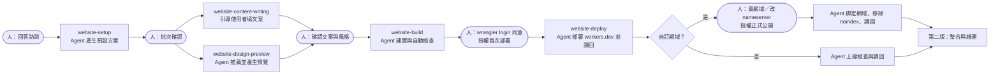

# ADR 0003：官網打造工作流採 Agent 全程執行、Astro 靜態站點＋Cloudflare 免費方案

- 狀態：Accepted（2026-09-05 維護者確認；`website-setup` 骨架已建立，六個待決事項採建議預設）
- 日期：2026-09-05
- 範圍：`skill-packs/website-building/` 第一個版本快照

## 背景

README 把「官網打造工作流」列為第五個技能包，目前狀態是「尚待設計」，也是五個技能包中唯一還沒有目錄的。階段 1 的待辦「定義一人公司最小可用官網的使用者故事、交付成果與技術選擇原則」尚未完成。

維護者已有一個實際運作中的個人品牌官網專案（以下稱「參考專案」），使用 Astro 靜態輸出、Tailwind CSS，透過 Cloudflare Workers 靜態資產部署，並在專案內建立了一個「風格探索與 HTML 預覽」技能。這條路線已經走過設計、開發、DNS、上線與日常維護，適合作為公開工作流的設計證據。

參考專案的做法是「人操作、AI 輔助」。本技能包的目標相反：**交給 AI Agent 全程執行，人類只在需要授權或需要做決定時介入**。因此不能直接複製參考專案的步驟，必須把每個人工動作重新分類為「Agent 可代辦」或「人類必須親自做」。

依 `AGENTS.md`，參考專案的品牌名稱、網域、服務價格、外部連結、電子報來源、Notion 資料庫、部署 Hook 與 n8n 設定都屬於私人脈絡，只能抽出通用流程，不得進入公開套件。

## 核心原則：Agent 執行，人類只授權與決定

1. **一次訪談**：商業資訊只在 `website-setup` 問一次，之後所有技能從設定檔讀取，不再重複詢問。若工作區已有其他技能包的設定（例如社群媒體策略或知識庫的一人公司設定），Agent 先讀取作為預設值，再請使用者確認差異。
2. **預設值優先、批次確認**：每個技能先產生完整的預設方案（頁面清單、風格、文案、部署目標），一次列給使用者確認或修改，不逐項發問。使用者說「全部用預設」時，只剩授權關卡。
3. **Agent 做所有可代辦的操作**：建立專案、安裝依賴、寫程式、產生圖片佔位、建置、預覽、截圖檢查、部署、綁網域、讀回驗證，全部由 Agent 執行。
4. **人類只做四類事**：提供事實、做取捨決定、完成外部帳號的登入與同意、授權付費或公開發布。
5. **每個外部動作都有預覽、授權、讀回**：Agent 先說明將要做什麼與影響範圍，取得明確授權，執行後從平台讀回結果，不以「指令沒有報錯」當作完成。

### 人類接觸點清單

這是本技能包對使用者的承諾。第一版完成時，人類需要親自做的事只有下列項目；其餘都由 Agent 完成。

| 接觸點 | 類型 | 頻率 | 為何不能由 Agent 代辦 |
|---|---|---|---|
| 回答商業資訊訪談（服務對象、提供什麼、為何可信、希望訪客做什麼、聯絡方式） | 提供事實 | 一次 | 只有使用者知道 |
| 確認頁面清單、風格與文案的預設方案 | 決定 | 每個技能一次批次確認 | 品牌取捨屬於使用者 |
| 建立 Cloudflare 帳號 | 帳號 | 一次 | Agent 不得建立帳號 |
| 在瀏覽器完成 `wrangler login` 的 OAuth 同意 | 登入 | 一次，Token 到期後再一次 | 登入與同意必須由本人操作 |
| 授權首次部署到 `workers.dev` | 授權 | 一次 | 建立公開連結 |
| 決定 `workers.dev` 帳號子網域名稱（首次啟用時） | 決定 | 一次 | 名稱屬於品牌取捨 |
| 購買網域（若要自訂網域） | 付費 | 一次 | 付費操作，Agent 不得輸入付款資料 |
| 在 Cloudflare 後台「Add a site」加入網域並選免費方案（只在網域不是向 Cloudflare 購買時） | 外部帳號 | 一次 | Wrangler 的 OAuth 沒有建立 zone 的權限；改用 API Token 同樣要人進後台建立，人直接加入反而較省 |
| 在網域註冊商改 nameserver 指向 Cloudflare（只在網域不是向 Cloudflare 購買時） | 外部帳號 | 一次 | 註冊商後台需要本人登入 |
| 授權綁定自訂網域與正式公開（移除 noindex） | 授權 | 一次 | 公開發布 |
| 提供 Logo、個人照片等自有素材 | 提供事實 | 可選 | Agent 可先用佔位圖，使用者想換再提供 |

## 決策

1. **目標產物**：一人公司最小可用官網，固定包含首頁（價值主張、服務、信任、行動呼籲）、關於、服務／產品、部落格列表、單篇文章、聯絡入口、404、RSS 與 sitemap。案例、作品集與其他頁面列為可選。
2. **技術路線**：Astro 靜態輸出（`output: 'static'`）＋ Tailwind CSS ＋ TypeScript。不使用 SSR adapter、不綁定 KV／D1／R2，避免引入需要付費或需要額外授權的資源。
3. **託管**：Cloudflare Workers 靜態資產（`wrangler.jsonc` 只宣告 `assets.directory`），使用免費方案。預設先部署到免費的 `*.workers.dev` 子網域，自訂網域是使用者授權後的第二步。
4. **部署方式**：預設由 Agent 在本機執行 `npx wrangler deploy`，人類只在 `npx wrangler login` 時於瀏覽器點一次同意。Git 連動 Workers Builds 需要使用者進 Cloudflare 後台連接 GitHub／GitLab，人工步驟較多，降為可選路線，只在使用者主動要求時提供。
5. **自訂網域**：`website-setup` 先問「現在有沒有網域」，依答案走下列路線；每條路線都以「人類步驟最少」為排序依據。網域的 DNS 一旦託管在 Cloudflare，Agent 就在 `wrangler.jsonc` 宣告 `custom_domain` 路由，部署時由 Cloudflare 自動建立 DNS 記錄與憑證（官方文件已確認），不需人工進後台。
   - **沒有網域**：先用免費的 `<Worker 名稱>.<帳號子網域>.workers.dev` 上線，自動 HTTPS。帳號子網域首次啟用時由使用者取名一次，其餘 Agent 完成。網址帶 `workers.dev` 對品牌與 SEO 不利，之後想換再進下一條路線。
   - **要買網域，優先 Cloudflare Registrar**：以成本價出售，買完自動在同帳號 DNS 託管，人只剩付款一步，綁定、憑證、重新導向全由 Agent 完成。Registrar 只支援部分頂級網域；`.tw` 與 `.com.tw` 依維護者記憶不在清單內，官方清單頁面為動態載入尚未機器確認，實作時必須對官方清單核對並記錄在 `docs/cloudflare-boundary.md`。
   - **向其他註冊商買，或既有網域不在 Cloudflare**：人做三件事，付款、在 Cloudflare 後台「Add a site」選免費方案、到註冊商改 nameserver。Agent 先準備要填的 nameserver 值，用 DNS 查詢輪詢生效，生效後全部自動。不採用 API Token 路線代辦「Add a site」，因為建立 Token 本身也是後台操作，人類步驟沒有減少。
   - **既有網域已在 Cloudflare**：人只授權一次，其餘全自動。
6. **內容管理**：預設以 repository 內的 Markdown（Content Collections）為唯一內容來源。第一版由 Agent 依訪談撰寫初始文案與範例文章。外部 CMS 同步（例如 Notion）、定時重建與 n8n 排程不進第一版。
7. **圖片與素材**（2026-09-05 修訂）：範本內建 14 張 Unsplash 授權示範照片（經 Picsum 取得，授權允許商用且不需標示，`photos.json` 記錄作者與原網址，總量約 1MB），六個主題各挑合適的照片並用 CSS 濾鏡配合調性，讓預覽與初版網站有真實感。Agent 另產生 favicon、OG 圖與 SVG 圖示。示範照片只是佔位，上線前應換成使用者自己的照片；使用者提供的 Logo 或照片由 Agent 放入正確位置與尺寸。若使用者安裝了生圖技能，可在授權後用來產生 Hero 圖，但不是本套件的依賴。
8. **起始範本**：套件內自帶一份去識別化的 Astro 起始範本（`template/`），品牌、文案、圖片、價格全部使用虛構範例，並以 `site.config.ts` 參數化。範本是本專案自有程式，採 Apache-2.0；不把參考專案整包複製進來。
9. **秘密與帳號**：套件不保存任何 Cloudflare API Token。本機部署一律使用 Wrangler 自己的 OAuth 登入狀態。若某個動作（例如新增 zone、DNS 記錄）超出 Wrangler OAuth 範圍，Agent 說明需要的最小權限，由使用者在後台建立受限 API Token，Token 依社群媒體套件的原生憑證庫設計存入作業系統憑證庫，不寫進設定檔或狀態檔。
10. **第三方依賴**：Astro、Tailwind CSS、Wrangler 與 Astro 官方整合套件都是官方 npm 套件，由範本的 `package.json` 鎖定確切版本並附 lockfile；manifest 記錄套件名稱、版本、授權與官方文件。不 vendoring、不追蹤 `latest`。
11. **風格來源**（2026-09-05 修訂）：範本內建六個完整主題，六大調性各一，每個主題依 open-design（Apache-2.0，固定 commit）的一份設計指引完整實作：版面結構、字型層次、間距、元件形狀、導覽與頁尾都不同，不是同一版面換顏色。主題用意象命名（紙本書店、夜間工作室、留白畫廊、黑白展場、遊樂場、報刊編輯），指引來源記錄在 `theme.json` 與第三方聲明，不把品牌名當使用者可見的預設值。選風格時 Agent 產生本機畫廊，用維護者預先以 Node 建置並內嵌成單檔的真實頁面展示，替換成使用者的站名與文案；使用者端不需要 Node 與網路。最初以「一組 token 換色」實作的版本已廢棄，因為不符合「每個調性一套完全不同的設計」的要求。第二次修訂再把六套的敘事結構拉開（長文、產品頁、純文字留白、全幅照片章節、彩色便當格、報紙頭版），並讓每個主題載入不同的 Google Fonts 中文字型（楷體、黑體細字重、圓體、明體等），因為畫面上九成是中文，只換 Latin 字型看不出差別。`site.fonts` 預設 `google`，會向 Google 發字型請求，可改 `system` 完全不發外部請求；這個取捨在 setup 的批次確認裡用一句話說明。所有新增主題的指引來源都要符合納入門檻：OSI 授權、GitHub Stars 一萬以上或大廠出品、近 90 天有更新、能固定 commit、不含品牌圖片或字型檔。第三次修訂（2026-09-05）：維護者檢視後認為只靠設計代幣文件做出來的六套仍像同一隻手，因此改以三個公開的商業 Astro 主題示範頁（付費主題，授權不允許再散布）作為**版面參考**，重做三個主題：暗房（黑底巨字、編號服務清單、游標拖尾）、晨光（漸層大圓角面板、高低交錯的照片列）、日光（滿版照片首屏、黑色跑馬燈橫條、編號路線圖）。只借鏡區塊順序、版面手法與動畫類型，程式碼、文案、圖片與字型檔皆未複製，來源網址記在各主題 `theme.json` 的 `source_references`，`source_kind` 為 `layout_reference`。同時加入共用動畫層 `src/lib/motion.ts`（Motion 13.2.0，MIT，固定版本）：進場、依序進場、視差、跑馬燈、游標聚光、游標拖尾、數字計數，全部尊重 `prefers-reduced-motion`，沒有 JavaScript 時內容照常顯示。夜間工作室、黑白展場、遊樂場三個主題退場。第四次修訂（2026-09-06）：使用者再給三個公開示範頁，剩下三個主題也以同樣方式重做：小夜燈（個人設計師作品集：打招呼式首屏、瀏覽器視窗框、貼紙與星形、四色服務卡、大字嵌圓形照片）取代紙本書店，白盒子（建築事務所：滿版照片加引號巨標、淡色巨字背景、錯落文章格、編號可展開服務列、逐字上升、磁吸按鈕）取代留白畫廊，週刊（慢新聞雜誌：報頭雙層導覽、三欄雜誌首屏、傾斜封面、引言輪播、排行榜配深色行動盒）取代報刊編輯。調性 `warm_literary`（溫暖書卷）改名為 `personal_friendly`（親切個人），因為新主題以人為主角而非紙張質感。至此六個主題都是版面參考型，open-design 只保留為日後擴充的可選來源；共用動畫層新增 `data-split`（逐字或逐詞上升）、`data-magnet`（磁吸按鈕）、`data-rotator`（引言輪播）。預設主題改為白盒子。納入門檻對「版面參考」的解讀：參考對象必須是公開可瀏覧的示範頁，且只取不受著作權保護的版面概念。
12. **自動化驗證**：頁面檢查、RWD、404、連結、sitemap、robots、OG 由 Agent 自動完成。優先使用用戶端內建的瀏覽器工具截圖；沒有時使用 Playwright（官方 npm 套件，列為可選依賴，安裝前說明容量）。人類只看 Agent 整理的截圖與讀回結果。

## 風格來源

查核日期：2026-09-05。Stars 與授權來自 GitHub API。

| 角色 | 專案 | Stars | 授權 | 在本套件的用法 | manifest 狀態 |
|---|---|---|---|---|---|
| 格式標準與檢查器 | [google-labs-code/design.md](https://github.com/google-labs-code/design.md) | 27.7k | Apache-2.0 | Google Labs 訂的 `DESIGN.md` 規格。主題改為自有程式實作後，此規格只作為日後解析外部指引的參考 | 參考，未進安裝路徑 |
| 風格庫 | [nexu-io/open-design](https://github.com/nexu-io/open-design) | 94k | Apache-2.0 | 154 個 `DESIGN.md`，參考專案已實際使用。執行時按需下載單一風格並快取到工作區 | 必要依賴，固定 commit |
| 顧問技能 | [nextlevelbuilder/ui-ux-pro-max-skill](https://github.com/nextlevelbuilder/ui-ux-pro-max-skill) | 125k | MIT | 配色、字型搭配、UX 規則，協助 Agent 從訪談結果推薦調性 | 可選，未安裝時 Agent 以內建調性表推薦 |
| 現成主題 | [saadeghi/daisyui](https://github.com/saadeghi/daisyui) | 42k | MIT | Tailwind 主題套件，與 Astro＋Tailwind 直接相容。使用者不想選風格時的預設 | 可選，固定版本 |
| 大廠設計系統 | IBM Carbon、Adobe Spectrum CSS、Vercel Geist | 9.4k／1.3k／3.6k | Apache-2.0／Apache-2.0／OFL-1.1 | 偏產品後台 UI，不適合一人公司形象站 | 只列於參考文件，不安裝 |

不列為依賴的可信專案：shadcn/ui（MIT）與 tweakcn（Apache-2.0）以 React 元件為主，靜態 Astro 站不需要 React；anthropics/skills 的 frontend-design 星星數最高，但 repository 沒有統一授權，各技能須個別確認後才能引用。

## 為何選 Cloudflare Workers 靜態資產

| 方案 | 費用 | 自訂網域 | Agent 可代辦程度 | 備註 |
|---|---|---|---|---|
| Cloudflare Workers 靜態資產 | 免費方案可用 | 可，DNS 同一後台 | 高：Wrangler 一次登入後，部署與網域綁定都能由 CLI 完成 | 參考專案已實際運作；Cloudflare 官方目前以 Workers 為新專案建議入口 |
| Cloudflare Pages | 免費方案可用 | 可 | 中：Git 連動需進後台操作 | 功能與 Workers 靜態資產重疊，官方逐步整併 |
| GitHub Pages | 免費 | 可 | 中：需 GitHub Actions 與後台設定 | 只支援公開 repository 免費，沒有 DNS、快取、重新導向整合 |
| Vercel／Netlify 免費方案 | 免費，但有商業使用限制 | 可 | 高：也有 CLI | 一人公司屬商業用途，免費方案條款需逐一確認 |

選擇理由：免費、CDN、自訂網域、DNS 同一後台、CLI 能覆蓋幾乎所有操作，而且參考專案已經證明整條路線可行。其他方案列為文件中的替代路線，不在第一版提供技能支援。

## 技能拆分與順序

沿用社群媒體套件「逐技能完成流程審查後才加入 manifest」的做法。名稱以 `website-` 為前綴。每個技能的職責分成「Agent 執行」與「人類介入」兩欄。

| 順序 | 技能 | Agent 執行 | 人類介入 | 第一版 |
|---|---|---|---|---|
| 1 | `website-setup` | 讀取既有設定作預設；一次訪談；產生頁面清單、託管方案、網域現況、預算判斷；寫入 `website/config.json` 與不含秘密的狀態檔 | 回答訪談、批次確認預設方案 | 是 |
| 2 | `website-content-writing` | 列出每頁必填與可選欄位、用途與範例，引導使用者自己填；AI 只在使用者要求時填起點並標記為建議。不寫部落格文章 | 填寫必填欄位、決定 AI 建議採用或改寫、自己寫文章 | 是 |
| 3 | `website-design-preview` | 依訪談推薦調性與風格；下載固定 commit 的設計系統；產生單檔 HTML 預覽；用瀏覽器工具截圖 | 從預覽中選一個 | 是 |
| 4 | `website-build` | 從起始範本建立 Astro 專案；套用選定主題；填入內容；產生佔位素材；`npm ci`、`build`、`preview`；自動截圖與 RWD、404、連結檢查 | 無（僅在 Agent 發現需要取捨時才問） | 是 |
| 5 | `website-deploy` | 確認 Wrangler 登入狀態；產生部署預覽；`wrangler deploy` 到 `workers.dev`；讀回 HTTP、sitemap、robots、OG；宣告 custom domain 並讀回 DNS 與 HTTPS；移除 noindex | 建立 Cloudflare 帳號、`wrangler login` 同意、取 `workers.dev` 子網域名稱、授權首次部署、買網域、必要時 Add a site 與改 nameserver、授權正式公開 | 是 |
| 6 | `website-service-integration` | 表單、電子報、預約、付款、流量分析的串接程式與隱私說明 | 各服務的帳號登入與同意 | 否，第二版 |
| 7 | `website-operations` | 內容更新、依賴更新、備份、健康檢查、成效回顧 | 授權更新部署 | 否，第二版 |

第一版快照的最低目標是 1、4、5 三個技能加起始範本，能讓使用者只做「訪談、登入、授權」就從零走到 `workers.dev` 上線；2 與 3 在流程審查通過後加入同一版或下一版。



圓角節點是人類接觸點，方形節點全部由 Agent 執行。

## 套件結構

```text
skill-packs/website-building/
├── README.md
├── INSTALL.md
├── AGENTS.md
├── CLAUDE.md
├── LICENSE
├── THIRD_PARTY_NOTICES.md
├── install.manifest.toml
├── docs/
│   ├── architecture.md
│   ├── client-compatibility.md
│   ├── human-touchpoints.md          # 人類接觸點清單與每一項的理由
│   ├── cloudflare-boundary.md        # 免費方案限制、帳號動作、費用停止點、Wrangler OAuth 範圍
│   ├── data-and-credential-boundaries.md
│   └── verification-levels.md
├── scripts/
│   └── manage_install.py             # 沿用社群媒體套件的安裝／重跑／衝突／更新／回復／移除契約
├── template/                         # 去識別化 Astro 起始範本，虛構品牌
│   ├── package.json                  # 鎖定確切版本
│   ├── package-lock.json
│   ├── astro.config.mjs
│   ├── wrangler.jsonc
│   ├── site.config.ts                # 品牌、導覽、社群連結、聯絡方式等參數
│   ├── src/{components,content,layouts,pages,styles}/
│   └── public/images/                # 佔位圖與尺寸說明
├── skills/
│   ├── website-setup/
│   │   ├── SKILL.md
│   │   ├── agents/openai.yaml
│   │   ├── assets/default-config.json
│   │   ├── references/{website-config.schema.json, setup-state.schema.json, intake-questions.md, hosting-options.md, page-inventory.md}
│   │   └── scripts/manage_workspace.py
│   ├── website-content-writing/
│   ├── website-design-preview/
│   │   └── references/{tonalities.md, page-templates/, design-system-source.md}
│   ├── website-build/
│   │   └── scripts/{scaffold_site.py, check_site.py}   # 建立專案、產生佔位素材、自動檢查
│   └── website-deploy/
│       └── references/{wrangler-local-route.md, workers-builds-optional-route.md, custom-domain-and-dns.md, launch-checklist.md}
└── tests/
    ├── validate_package.py           # 靜態結構、frontmatter、連結、隱私字串
    ├── test_install_lifecycle.py     # 虛構安裝生命週期
    ├── test_workspace_config.py      # 設定檔 schema
    ├── test_template_build.py        # 需要 Node，以 WEBSITE_NODE_ACCEPTANCE=1 選擇性執行
    └── behavior-cases.md
```

## Manifest 要點

- `project_id = "website-building"`，`status = "local_candidate_first_skills"`，`support_level` 沿用「本機候選、未正式支援」。
- `requires_network = false`（安裝與設定），`[runtime]` 另標 `npm ci`、設計系統下載與 Cloudflare 操作需要網路。
- `[agent_execution]` 記錄本套件的執行原則：`default_mode = "agent_executes_human_authorizes"`、`human_touchpoints` 指向 `docs/human-touchpoints.md`、`batch_confirmation = true`。
- `[[dependencies]]` 逐一列出 Astro、Tailwind CSS、Wrangler、`@astrojs/sitemap`、`@astrojs/rss`、open-design、Playwright（可選）：套件名稱、固定版本或 commit、授權、官方來源、`bundle_source = false`。
- `[cloudflare]` 記錄免費方案的已知限制、需要授權的動作清單、費用停止點、Wrangler OAuth 涵蓋與不涵蓋的操作，以及「套件不保存 Token」的政策。
- `[[planned_skills]]` 列出第一版未完成的技能，`status = "not_implemented"`。
- `[[readiness_gates]]`：靜態結構、本機技能發現、範本 `npm ci`／`build`、自動化頁面檢查、`wrangler` 登入、`workers.dev` 部署、自訂網域、另一臺電腦、正式公開支援，全部先標 `not_performed`。

## 驗證層級

1. **靜態**：不需 Node，驗證結構、frontmatter、連結、隱私字串、schema。預設測試。
2. **本機建置**：需要 Node，`npm ci` 與 `astro build` 成功且產出 `dist/`。以環境變數選擇執行。
3. **自動化頁面檢查**：Agent 啟動 `astro preview`，用瀏覽器工具或 Playwright 在三個斷點截圖，檢查 404、內部連結、圖片尺寸與 meta。人類只看整理後的截圖。
4. **外部部署**：`wrangler login`、`wrangler deploy` 到 `workers.dev`，讀回 HTTP 200、sitemap、robots 與 OG。延後到所有工具包完成後集中驗收。
5. **自訂網域**：宣告 custom domain，讀回 DNS 記錄、HTTPS 與重新導向。延後。
6. **另一臺電腦與正式支援**：延後。

依 README 原則，本機驗證、人工驗收與遠端發布狀態分開回報；延後不代表通過。

## 從參考專案抽取與排除的內容

| 抽取為通用流程 | 排除或改為虛構 | 因「Agent 執行」而改變的做法 |
|---|---|---|
| Astro＋Tailwind＋Workers 靜態資產的設定方式 | 品牌名稱、網域、Logo、色系名稱 | 部署預設改為 Agent 跑 `wrangler deploy`，Git 連動降為可選 |
| 頁面結構、Content Collections frontmatter 欄位 | 服務方案、價格、外部購買連結 | 自訂網域由 wrangler 宣告，不再手動進後台綁定 |
| 圖片清單、建議尺寸與格式 | 實際圖片與截圖 | 圖片由 Agent 產生佔位，使用者素材改為可選 |
| 六大調性、風格選擇、HTML 預覽產生規則 | 已下載的設計系統快取 | Agent 先推薦，人只選一次 |
| DNS 綁定與上線前檢查步驟 | 電子報 RSS 來源、Notion 同步、n8n 排程、部署 Hook 網址 | 上線檢查由 Agent 自動讀回 |
| 「不覆蓋使用者素材」等注意事項 | 進度追蹤檔、遊戲頁面與其他非官網功能 | 訪談集中在 setup 一次完成 |

## 待維護者決定

1. 起始範本放在套件內（建議，自有程式、可離線安裝），還是另立公開 repository 以固定 commit 引用（與 Learn-GAS 相同模式）。
2. 第一版快照是否要包含 `website-content-writing` 與 `website-design-preview`，還是先以 setup、build、deploy 三個技能打通上線。
3. 表單、電子報、分析等外部服務是否列為第二版，或第一版只留「聯絡方式為 mailto 或外部連結」的最小做法。
4. 是否接受 Playwright 作為可選依賴，供沒有內建瀏覽器工具的用戶端做自動化頁面檢查。
5. 先用哪個用戶端做本機技能發現測試（社群媒體套件先以 Codex 驗證）。
6. 風格來源的納入門檻（OSI 授權、Stars 一萬以上或大廠出品、近 90 天有更新、固定 commit、不含品牌資產）是否照此寫進 manifest 與 README。

## 實作時必須確認的外部事實

- Cloudflare Registrar 支援的頂級網域清單，特別是 `.tw` 與 `.com.tw` 是否可購買。
- （2026-09-05 已確認）Custom Domain 需要已啟用的 zone、主機名完全一致、部署時自動建 DNS 與憑證；Worker 名稱規則；靜態資產支援 `_redirects`。詳見套件的 `docs/cloudflare-boundary.md`。
- Wrangler 目前 OAuth 登入的權限範圍是否包含建立 zone；本 ADR 假設不包含。
- `workers.dev` 帳號子網域首次啟用是否能由 `wrangler deploy` 互動完成，或必須進後台。
- open-design 與 design.md 的固定 commit、`@google/design.md` 的固定版本與授權檔 SHA-256。

## 失敗與替代方案

- Cloudflare 免費方案條款或限制改變時，先保留 `workers.dev` 路線，另立 ADR 評估 Pages 或其他託管。
- Wrangler OAuth 範圍不足以完成某個網域操作時，Agent 停止並說明需要的最小 API Token 權限，不改用瀏覽器自動化替使用者操作後台。
- Astro 主版本升級時，先在範本上完成建置與部署驗證，再更新 manifest 版本；使用者既有專案不自動升級。
- open-design 不可用或授權改變時，套件仍能以內建的中性預設樣式或 daisyUI 主題完成建置，只是失去風格選擇。
- Cloudflare Registrar 不支援使用者想要的頂級網域時，改走外部註冊商路線，不因此阻擋 `workers.dev` 上線。
