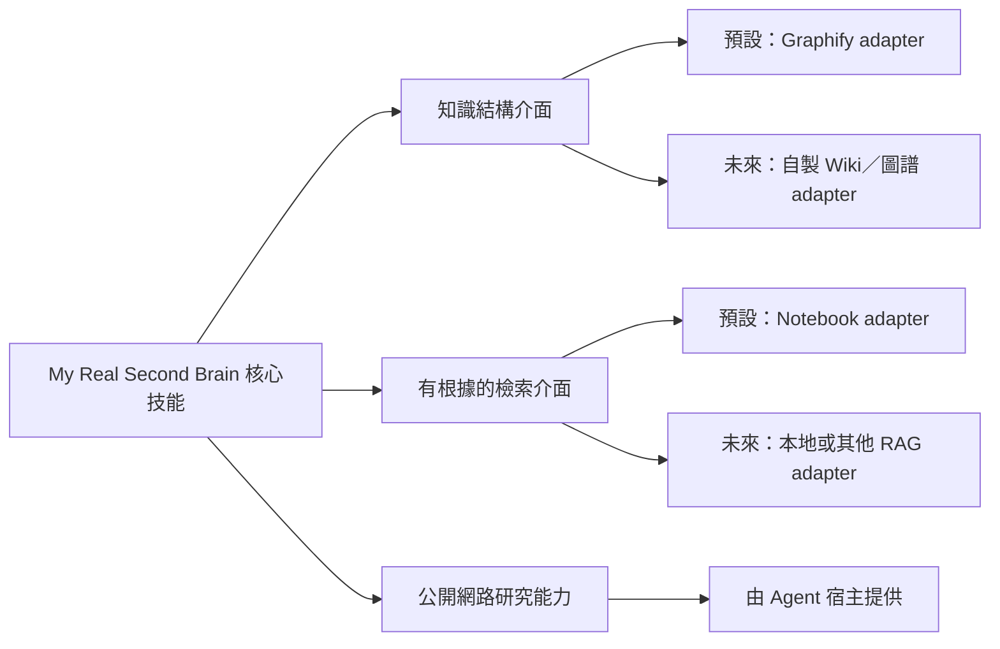

# 可替換後端契約

## 原則

`My Real Second Brain` 的核心是第一大腦心得、次級資料、知識生命週期、來源優先度與引用規則，不是 Graphify 或 Notebook。兩者只是目前預設的後端實作。

## 能力一：知識結構後端

目前預設：Graphify。

後端至少應提供：

- 檢查安裝與健康狀態。
- 從指定本地來源建立或更新結構。
- 查詢節點、關係、路徑與來源。
- 保留抽取、推論與不確定性的標記。
- 提供人類可以探索的視覺化，或明確宣告不支援。
- 偵測過期、異常縮減與不安全重建。

## 能力二：有根據的外部檢索後端

目前預設：Google Notebook，由 `notebooklm-py` 操作。

後端至少應提供：

- 建立及列出知識集合。
- 新增、列出與同步來源。
- 針對指定集合與來源查詢。
- 回傳可追溯的來源 ID、標題與引用。
- 回報同步時間、處理狀態與錯誤。
- 不把登入秘密或大型全文寫入本機索引。

## 能力三：公開網路研究能力

`socratic-dialogue` 在第二大腦資料不足、可能過時或缺少可信反方時，需要使用目前 Agent 可用的公開網路研究能力。這項能力由 Agent 宿主提供，不在 `install.manifest.toml` 鎖定特定搜尋服務。

至少應能：

- 搜尋並開啟公開網頁。
- 優先找到官方文件、原始研究、第一方資料與原始統計。
- 分辨發布日期、更新日期與資料可能過期的風險。
- 在回答中提供可以直接開啟的原始網址。
- 說明每個來源支持、補充或挑戰哪一項說法。
- 無法上網時明確回報限制，不假裝已完成查證。

網路資料預設只用於當次對話。只有使用者明確要求長期保存時，才依 `template/sources/references/README.md` 的格式寫入 `sources/references/`。

## 核心與後端的邊界

核心技能應表達「建立知識結構」「查詢外部集合」「取得引用」，而不是永久寫死某個上游命令。預設 adapter 可以呼叫 Graphify 與 `notebooklm-py`，未來則可以替換成自製 Wiki、其他圖資料庫、本地 RAG 或其他託管服務。

替換 provider 不得要求改寫使用者的讀書筆記、次級資料、Wiki 或來源索引格式；若能力不等價，adapter 必須明確回報差異。
