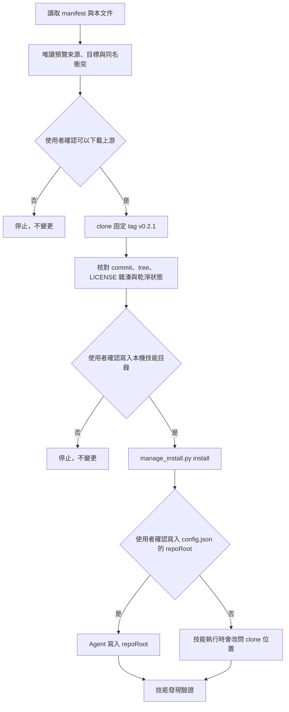

# 本機候選版安裝

本套件安裝上游 [iamraven-tw/agent-inventory](https://github.com/iamraven-tw/agent-inventory) `v0.2.1` 的六個技能：`inventory`、`inventory-setup`、`inventory-scan`、`inventory-summarize`、`inventory-flow`、`inventory-serve`。本套件沒有自有技能。

安裝管理器不連網、不執行掃描、不讀取使用者的規則內容、不修改任何既有技能。唯一的連網步驟是由 Agent 依本文件 clone 上游 repository，並在下載前先向使用者說明來源與固定版本。



## 前置條件

- Python 3.11 以上（管理器）與 Python 3.9 以上（上游腳本）。
- `git`。
- 目標用戶端已安裝，且技能目錄存在。

## 步驟

1. **唯讀預覽**。先執行 `status`，確認目前沒有安裝，也沒有同名技能：

   ```bash
   python3 scripts/manage_install.py status \
     --registration claude_user \
     --client-root "$HOME/.claude/skills" \
     --state-root "$HOME/Library/Application Support/ai-workflow-toolbox/agent-inventory"
   ```

2. **取得使用者同意後下載上游**。說明來源網址、固定 tag、授權與容量（約 2 MB），再 clone 到狀態目錄底下，不要放進任何技能掃描範圍：

   ```bash
   git clone --branch v0.2.1 https://github.com/iamraven-tw/agent-inventory.git \
     "$HOME/Library/Application Support/ai-workflow-toolbox/agent-inventory/source/v0.2.1"
   ```

3. **安裝**。管理器會先核對 commit `c162b0adce4d1519b60f76de15bc00df85d611ce`、tree、LICENSE 的 SHA-256 與工作樹是否乾淨，任何一項不符就停止：

   ```bash
   python3 scripts/manage_install.py install \
     --registration claude_user \
     --client-root "$HOME/.claude/skills" \
     --state-root "$HOME/Library/Application Support/ai-workflow-toolbox/agent-inventory" \
     --manifest install.manifest.toml \
     --inventory-source "$HOME/Library/Application Support/ai-workflow-toolbox/agent-inventory/source/v0.2.1"
   ```

4. **寫入 `repoRoot`**。上游技能靠設定檔的 `repoRoot` 找到 clone。取得使用者確認後，由 Agent 建立或更新 `~/.config/agent-inventory/config.json`，只動這一個鍵，其他欄位保留：

   ```bash
   python3 - "$HOME/Library/Application Support/ai-workflow-toolbox/agent-inventory/source/v0.2.1" <<'EOS'
   import json, os, sys
   path = os.path.expanduser("~/.config/agent-inventory/config.json")
   cfg = json.load(open(path, encoding="utf-8")) if os.path.isfile(path) else {}
   cfg["repoRoot"] = sys.argv[1]
   os.makedirs(os.path.dirname(path), exist_ok=True)
   with open(path, "w", encoding="utf-8") as f:
       json.dump(cfg, f, ensure_ascii=False, indent=2); f.write("\n")
   print("repoRoot =", cfg["repoRoot"])
   EOS
   ```

   使用者不想寫入也可以：技能執行時會發現沒有 `repoRoot`，改問 clone 放在哪。

5. **驗證**。重新開啟用戶端工作階段，確認六個技能都能被發現。

## 註冊目標

| 註冊 ID | 用戶端 | 技能目錄 |
|---|---|---|
| `claude_user` | Claude Code | `$HOME/.claude/skills` |
| `claude_workspace` | Claude Code | `<workspace>/.claude/skills` |
| `codex_user` | Codex | `$HOME/.agents/skills` |
| `agents_workspace` | Codex、Antigravity | `<workspace>/.agents/skills` |
| `antigravity_user` | Google Antigravity | `$HOME/.gemini/config/skills` |

## 執行盤點時的注意事項

上游六個技能開頭都會先取得 `$REPO`：讀設定檔的 `repoRoot`，沒有就看目前目錄是不是 clone，都不是就問使用者。之後所有指令與 `data/` 路徑都用 `"$REPO/…"` 絕對路徑，從任何目錄執行結果相同。安裝狀態檔的 `active.upstream_source` 也記著同一個路徑，可用 `status` 讀出來核對。

## 更新、回復與移除

```bash
python3 scripts/manage_install.py update   ... --manifest ... --inventory-source <新版 clone>
python3 scripts/manage_install.py rollback ...
python3 scripts/manage_install.py remove   ...
```

- `update` 先快照現況再交易式替換；失敗時還原。
- `rollback` 回到最近一次已驗證的歷史版本。
- `remove` 只把六個受管理技能移到狀態目錄下的可回復隔離區，不動使用者其他技能，也不刪除上游 clone 與 `~/.config/agent-inventory/`。

## 不會發生的事

- 不會覆寫同名且非本套件管理的技能，遇到就停止。
- 不會修改 shell 設定檔。
- 不會在安裝過程執行掃描或產生摘要。
- 不會刪除使用者的任何規則、技能或掃描結果。
