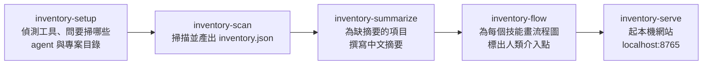

# AI Agent 規則與技能盤點技能包

這個技能包讓 AI Agent 幫使用者盤點自己電腦上所有 AI coding agent 的**全域規則、全域技能、專案規則、專案技能**，為每一條寫一段中文摘要，最後用本機網站呈現。

實際做事的程式與六個技能來自公開專案 [iamraven-tw/agent-inventory](https://github.com/iamraven-tw/agent-inventory)（MIT）。**本套件不複製上游原始碼**，只負責用固定版本安裝、驗證、註冊到各用戶端，並把隱私與授權邊界寫清楚。

| 項目 | 內容 |
|---|---|
| 上游版本 | `v0.2.1`（commit `c162b0a`） |
| 授權 | MIT |
| 執行需求 | Python 3.9 以上、git；不安裝任何第三方套件 |
| 受管理技能 | `inventory`、`inventory-setup`、`inventory-scan`、`inventory-summarize`、`inventory-flow`、`inventory-serve` |
| 本套件自有技能 | 無。上游已提供 `/inventory` 總入口，不再多包一層 |

完成安裝後，使用者一次確認工具與專案掃描範圍，Agent 自動完成掃描、摘要、所選流程圖與本機報告；不需要逐技能重新下指令。

## 使用者會得到什麼

安裝後，在任何支援的 Agent 用戶端輸入 `/inventory`，Agent 會依序完成五步：

上游宣告支援六個工具：Claude Code、Codex、Google Antigravity、Cursor、OpenClaw、Hermes Agent。其中 Cursor 與 OpenClaw 的路徑來自官方文件，上游尚未在真機驗證。

## 安裝與生命週期

安裝步驟見 [`INSTALL.md`](INSTALL.md)。管理器 `scripts/manage_install.py` 不連網，只從**已由 Agent clone 並通過雜湊驗證**的固定來源複製技能：

- `status`：唯讀檢查目前安裝狀態。
- `install`：首次安裝或安全重跑；同名且非本套件管理的項目一律停止，不覆寫。
- `update`：先快照現況再交易式替換。
- `rollback`：回復最近一次已驗證的歷史版本。
- `remove`：只把受管理的六個技能移到可回復隔離區，不動使用者其他技能。

安裝狀態寫在技能掃描範圍之外的狀態目錄，只記錄路徑、版本、雜湊與驗證結果。

## 這個套件不做的事

- 不複製上游原始碼進本 repository，不追蹤未鎖定的 `main`。
- 不在安裝過程執行掃描、不讀取使用者的規則內容、不寫任何摘要。
- 不修改、不刪除使用者既有的任何規則或技能。
- 不上傳任何掃描結果或摘要。

## 需要人類授權的關卡

盤點工具本身具備寫入與刪除能力，這些動作永遠由使用者決定，安裝器不會代為執行：

| 動作 | 由誰觸發 | 說明 |
|---|---|---|
| 下載上游 repository | 安裝前 | 唯一的連網步驟，先說明來源與固定版本 |
| 選擇掃描範圍 | `inventory-setup` | 要掃哪些工具、哪些專案根目錄 |
| 讀取規則全文寫摘要 | `inventory-summarize` | Agent 會讀規則內容；摘要規格禁止寫入密碼、Token 與帳號 |
| 刪除規則或技能 | 網站抽屜 | 上游會列出實際受影響路徑並要求輸入名稱，一律移到系統垃圾桶 |
| 在網頁上改寫原檔 | 網站抽屜 | 直接寫回實體檔案，存檔前備份並檢查雜湊衝突 |
| 手改摘要或流程圖 | 網站抽屜 | 只寫進 `data/user-summaries.json` 與 `data/user-flows.json`，不動原檔 |
| 用外部編輯器開檔 | 網站抽屜 | 在本機啟動文字編輯器、Finder、VS Code 或 Cursor |

## 隱私

- 掃描只讀檔，結果只寫進上游 clone 的 `data/`（上游已列入 `.gitignore`）。
- 網站只綁定 `127.0.0.1`。
- 網頁編輯器從 `esm.sh` 載入 CodeMirror 6，這是唯一的對外請求；離線時退回內建純文字編輯器。
- 詳見 [`docs/data-and-privacy-boundaries.md`](docs/data-and-privacy-boundaries.md)。

## 已知限制

- 上游六個技能靠 `~/.config/agent-inventory/config.json` 的 `repoRoot` 找到 clone，再以絕對路徑執行腳本與讀寫 `data/`。安裝器會在同一次安裝確認內寫入這個唯一來源鍵，保留掃描範圍。狀態中的來源快照只供回復，不作為第二份執行設定。
- Cursor 與 OpenClaw 的路徑尚未在真機驗證；Antigravity 的對話紀錄是二進位資料庫，使用次數無法對應。
- 完整清單見 `install.manifest.toml` 的 `[[known_limitations]]`。

## 目前狀態

本機候選版，尚未正式支援。靜態結構、虛構資料生命週期測試，以及「從 GitHub 乾淨 clone `v0.2.1` 後核對 commit、tree、LICENSE 雜湊並實際安裝六個技能」都已在維護者的 macOS 上通過；用戶端技能發現、實際盤點與另一臺電腦驗收尚未執行，見 manifest 的 `[[readiness_gates]]`。
