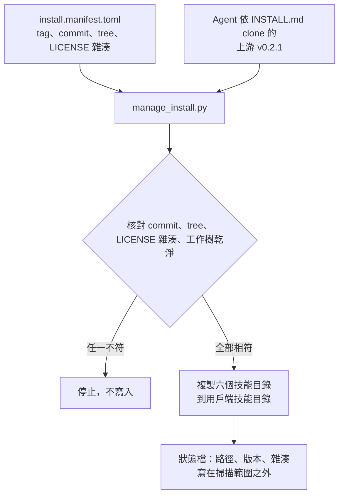

# 架構

## 職責切分

| 層 | 位置 | 負責 |
|---|---|---|
| Toolbox 技能包 | `skill-packs/agent-inventory/` | 固定上游版本、驗證完整性、註冊技能、生命週期、隱私與授權邊界文件 |
| 上游技能包 | `iamraven-tw/agent-inventory` `v0.2.1` | 六個技能、六個工具轉接器、掃描與合併腳本、本機網站 |

Toolbox 這一層**沒有自有技能**。上游已提供 `/inventory` 總入口，再包一層只會重複，也會讓使用者分不清該叫哪一個。

## 安裝資料流



## 執行資料流

盤點本身完全由上游技能執行，Toolbox 不介入：

```text
inventory-setup  → ~/.config/agent-inventory/config.json（掃哪些工具、哪些專案根目錄）
inventory-scan   → <clone>/data/inventory.json、usage.json、pending-summaries.json
inventory-summarize → Agent 讀檔寫摘要 → <clone>/data/summary-cache.json
inventory-flow   → Agent 為每個技能畫 Mermaid 流程圖 → <clone>/data/flow-cache.json
inventory-serve  → http://127.0.0.1:8765/site/
```

所有產物都留在上游 clone 的 `data/` 底下，上游已將其列入 `.gitignore`。

## 為什麼不複製上游原始碼

Toolbox 的 `docs/dependency-policy.md` 要求第三方專案由 manifest 從正式來源取固定版本，不直接複製進 repository。複製會造成兩份程式各自演進、上游修正無法傳遞，也會讓授權與出處難以追溯。`google-automation` 包 Learn-GAS 用的是同一個模式。

## 狀態檔

路徑為 `<state-root>/registrations/<註冊 ID>-<目標雜湊前綴>.json`，只記錄：

- `active.toolbox_version`：本套件候選版號。
- `active.upstream_ref`、`active.upstream_tree`：已驗證的上游版本。
- `active.source_snapshot`：安裝版本的來源快照，僅供回復該歷史版本；不是執行路由。唯一執行來源是設定檔的 `repoRoot`，由安裝／更新／回復一併寫入；其他設定保留。舊狀態 `upstream_source` 只相容讀取，不再產生新的同名來源欄位。
- `status.runtime_source_status`：核對唯一來源的可用性與版本，缺少或不符時不得宣稱可直接執行。
- `active.entries`：六個技能各自的種類與內容雜湊。
- `history`、`future`、`removed`：更新、回復與移除的快照位置。

不含帳號、憑證或任何掃描結果。
