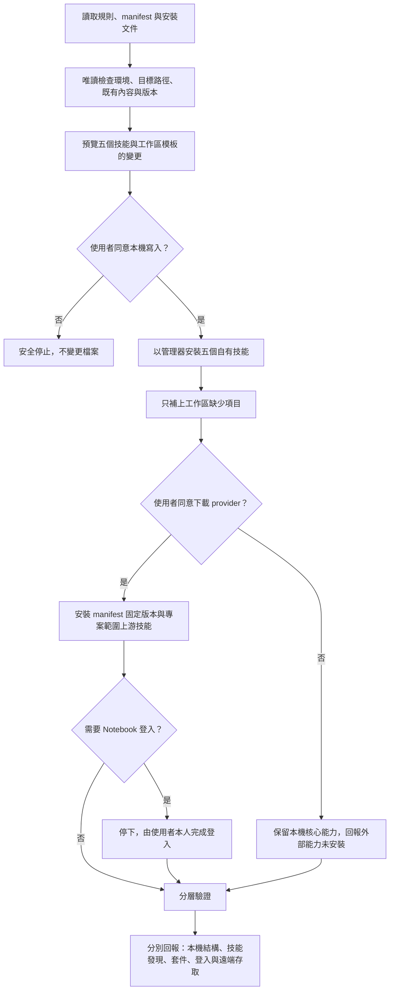

# 交給 AI Agent 的安裝入口

本文件是 `My Real Second Brain` 的人類可讀入口；`install.manifest.toml` 是機器可讀的單一依據。一般使用者只要指定想使用的 Agent 與工作區，不需要自行複製五個技能或研究內部目錄。

目前狀態是「可安裝候選版，等待外部驗收」，不是正式支援。自有技能與工作區可在不連線外部帳號的情況下安裝；Graphify、`notebooklm-py`、Notebook 登入與遠端存取是分開的後續關卡。

## 安裝流程

## Agent 執行規則

1. 完整讀取 `docs/installation.md`、`docs/client-compatibility.md` 與 `docs/providers.md`。
2. 技能清單、來源、版本、registration 與 provider 固定版本一律來自 manifest，不依文件段落自行猜測。
3. 先做唯讀預覽；寫入技能、初始化工作區、下載、安裝、更新、移除 provider 或開啟登入流程前，分別取得使用者同意。
4. 使用 `scripts/manage_install.py` 管理五個自有技能。相同版本重跑應為 no-op；不同版本不得由 `install` 靜默取代。
5. 先執行 `workspace-status`，再於使用者確認後執行 `init-workspace`。模板只新增缺少項目；既有一般檔案即使內容不同也原樣保留，檔案與目錄類型衝突則在寫入前停止。
6. 自有技能的狀態、快照與隔離區必須位於 Agent 技能掃描目錄外，而且不得保存憑證或知識內容。
7. provider 採正式套件來源與固定版本，不 clone 上游 repository，也不因有新版就自動升級。
8. Notebook 登入由使用者本人完成；Agent 不讀取、輸出或保存 Cookie、Token 或登入狀態內容。
9. Graphify 是關係與導覽工具，Notebook 是探索性外部能力；兩者不可取代本機核心資料。
10. 驗證失敗時停止並保留既有內容。移除自有技能不會移除 provider，也不會刪除第二大腦工作區。

完整命令、更新與回復方式，以及各層驗證標準請見 `docs/installation.md`。
