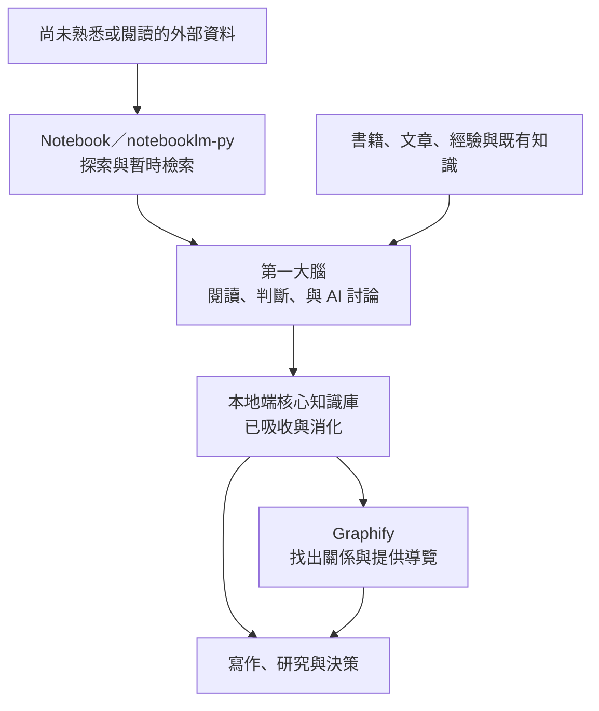

# My Real Second Brain

原 Learn-GAS 與 My Real Second Brain 的公開核心，今後只在 `raven-ai-workflow-toolbox` 維護；舊儲存庫不再提供後續功能更新。

> 讓第二大腦服務第一大腦，而不是取代第一大腦。

`My Real Second Brain` 是一套由 AI Agent 協助維護的個人知識系統。它把本地端知識、讀書筆記、知識圖譜與大型雲端資料來源接在一起，但最終的閱讀、理解、判斷與選擇，始終由人類負責。

目前版本是「可供外部驗收」的本機候選版，不是正式支援。五個自有技能、安裝生命週期與空白工作區可在本機驗證；第三方乾淨安裝、外部登入、遠端 Notebook 與另一臺電腦實測仍是分開的驗收關卡。

## 核心理念

第一大腦是使用者本人。第二大腦只負責保存、整理、連結、檢索與提醒，不把「AI 找得到」誤認為「人類已經理解」。

只有經過使用者親自閱讀、思考，或與 AI 討論後確認的內容，才會進入本地端核心知識庫。尚未閱讀或仍不熟悉的大量資料，可以先放在 Notebook 中探索，但預設知識優先度較低。

這個「較低」不是指 Notebook 裡的資料必然不正確，而是它尚未經過第一大腦充分吸收。遇到可驗證事實時，仍應比較來源品質、時間與證據，不能用個人筆記自動覆蓋較新的第一方資料。



## 知識層級

### 1. 本地端核心知識庫

本地端保存使用者已經親自接觸並消化過的內容，包括：

- 讀過的書籍與讀書心得。
- 閱讀過的文章與研究資料。
- 使用者與 AI 討論後形成的理解。
- 使用者自己的經驗、觀點、疑問與判斷。
- 經過確認的決策與工作方法。

這些內容具有最高的個人知識優先度。外部檢索結果不能直接覆蓋它；發生衝突時，系統應並列差異、保留引用，再交由使用者判斷。

### 2. Notebook 與 notebooklm-py

Notebook 適合保存大量、尚未完全閱讀，或使用者目前還不熟悉的資料。本專案透過 `notebooklm-py` 協助建立 Notebook、加入來源、查詢內容、取得引用，並在本地端保存不含大型全文的路由索引。

Notebook 中的內容屬於探索性知識。重要內容經使用者閱讀與確認後，才能整理進本地端核心知識庫。

### 3. Graphify

Graphify 負責分析本地資料之間的關係，產生可查詢的知識圖譜、報告與互動式 HTML 網頁。

Graphify 是關係分析與導覽工具，不是最高事實來源。圖譜中的推論必須保留信心標記，重要結論仍應回到原始文件與使用者的實際理解。

### 4. LLM Wiki

本專案採用 LLM Wiki 的持續累積觀念：保存原始來源、由 Agent 維護可演化的 Wiki，並以明確規則約束匯入、查詢、引用與維護。每次閱讀、討論與研究，都應留下未來可以再次使用的成果。

## 用說的，降低記錄門檻

這個專案強烈鼓勵使用者用口說記錄知識。讀完一章或一本書後，不必先整理成完整文章；可以打開 Typeless 這類語音轉文字工具，直接說出剛讀完的感受、疑問、同意與不同意之處，再交給 AI 保存和整理。

建議流程很簡單：

1. 趁內容還有印象時，先用自己的話說出來。
2. 將語音轉成文字後，檢查書名、人名與專有名詞是否正確。
3. 讓 `book-notes` 優先保留接近原話的內容，再另外整理核心觀點。
4. 只有使用者確認過的整理結果，才視為第二大腦中的正式知識。

Typeless 只是推薦範例，不是必要依賴，也不是本專案的官方整合；任何可靠的語音轉文字工具都可以使用。第三方工具可能會處理使用者的音訊或文字，使用前應自行確認隱私政策，不要口述不適合交給外部服務的敏感資訊。

## 第一次啟動與一人公司設定

如果使用者第一次啟動時沒有提出其他明確任務，而且 `sources/strategy/solopreneur-profile.md` 尚未完成，`solopreneur-profile` 會用一次一題的方式協助建立一人公司的長期設定。

設定內容包括目前階段、目標使用者、核心問題、產品與價值、取得客戶的方法、已有資產、限制、近期優先事項與仍待確認的假設。AI 會先顯示準備寫入的內容，取得確認後才更新檔案。

使用者已提出明確任務時，設定流程不會擋住工作。之後遇到創業方向、定位、客群、產品或優先順序問題，AI 才先讀設定檔與既有知識，再依需要啟動蘇格拉底式對話。

社群策略、內容規劃、平台角色、互動原則與成效判斷另外使用 `sources/strategy/social-media-strategy-and-insights.md`。公開版只提供 `not_configured` 空白範本；逐期報告先與使用者討論並加入使用者判斷，確認後才可把長期洞察寫入。

## 資料會存在哪裡

系統不會因為使用者把文件交給 AI Agent，就一律複製到本專案或上傳 Notebook。儲存位置取決於資料是「第一大腦心得」還是「外部次級資料」、是否需要長期保存，以及資料量是否大到不適合由 Agent 反覆載入。

| 資料或情況 | 預設位置 | 儲存原則 |
|---|---|---|
| 使用者確認的一人公司方向、客群、價值、限制與優先事項 | `sources/strategy/solopreneur-profile.md` | 第一次無明確任務且尚未設定時逐步建立；任何寫入先預覽並取得確認。 |
| 使用者確認的社群策略、平台角色與長期洞察 | `sources/strategy/social-media-strategy-and-insights.md` | 讀取成效報告後先與使用者討論；只把經確認的結論寫入，原始數據留在實際工作區。 |
| 使用者直接說出的讀書心得、觀點與判斷 | `sources/book-notes/` | 保存接近使用者原話的內容；同一本書持續追加到同一份 Markdown。 |
| 使用者明確要求納入本地知識庫的 PDF、TXT、文章、報告或軟體文件 | `sources/references/` | 保存可追溯的次級資料；不得把作者原文當成使用者心得。 |
| 已存在於其他本機位置的一般書籍或單一文件 | 原始位置 | 預設直接從原位置讀取，不自動複製到 `sources/references/`，也不自動上傳 Notebook。 |
| 只供本次討論或研究使用的附件 | 不建立永久副本 | 完成當次任務後不自動納入第二大腦；需要長期保存時再由使用者指定。 |
| 知識詰問中臨時搜尋的網路資料 | 不建立永久副本 | 當次回答附上可核對的原始網址；只有使用者明確要求長期保存時才寫入 `sources/references/`。 |
| 龐大資料集、跨大量文件，或反覆載入會明顯浪費 Token 的資料 | Notebook | 大型全文保存在 Notebook；本地只在 `sources/references/notebooks/` 保存路由索引、中繼資料、來源清單與同步狀態。 |
| Agent 根據心得與來源整理出的可演化知識頁 | `sources/wiki/` | 保存結構化整理與引用，不取代原始來源或使用者判斷。 |
| Graphify 或其他知識結構 Provider 產生的圖譜、報告與互動網頁 | `sources/graphify-out/` | 視為可重建的衍生輸出，不作為唯一事實來源。 |

判斷順序如下：

1. 一人公司的長期方向、社群策略與長期洞察，經使用者確認後寫入 `sources/strategy/`。
2. 使用者自己的閱讀心得與判斷，寫入 `sources/book-notes/`。
3. 普通大小的外部資料，預設保留原位置；只有使用者明確要求納入知識庫時，才保存到 `sources/references/`。
4. 只有資料量龐大、跨大量文件，或反覆載入成本過高時，才使用 Notebook；「尚未閱讀」或「目前不熟悉」本身不構成上傳理由。
5. 後續整理結果寫入 `sources/wiki/`，關係分析與視覺化寫入 `sources/graphify-out/`。

不論原始資料位於本地端或 Notebook，重要內容只有在使用者閱讀、討論與確認後，才能升級為本地端核心知識。

## 技能組與底層工具

本專案自行維護五個協調技能：

| 技能 | 用途 |
|---|---|
| `my-real-second-brain-setup` | 管理五個自有技能的安裝、更新、回復與移除，安全初始化工作區；取得同意後才處理固定版本的可替換後端。 |
| `solopreneur-profile` | 第一次無明確任務時逐步建立一人公司設定，並在創業問題中提供長期脈絡。 |
| `book-notes` | 優先保存使用者直接說出的第一大腦想法，再將閱讀與 AI 討論整理成一書一檔。 |
| `knowledge-source-retrieval` | 先查本機索引與核心知識，再選擇相關外部檢索集合，整合來源、引用與知識圖譜視覺化。 |
| `socratic-dialogue` | 先從第二大腦找出既有觀點，資料不足、過時或缺少反方時再搜尋網路，以白話的一問一答與階段摘要協助使用者形成共同理解。 |

底層實際操作由外部工具負責：

| 外部能力 | 用途 | 本專案的處理方式 |
|---|---|---|
| `notebooklm` 通用技能與 `notebooklm-py` | 建立 Notebook、加入來源、列出來源、查詢與取得引用 | 使用者同意後，AI Agent 才依固定版本安裝上游套件與技能；本倉庫不重製原始碼。 |
| Graphify | 建立、查詢與視覺化本地知識圖譜 | 使用者同意後，AI Agent 才依固定版本安裝上游套件與技能；本專案定義使用及 HTML 交付規則。 |

Graphify 與 Notebook 是目前的預設後端，不是系統本身。詳細邊界與替換契約請見 `docs/providers.md` 及 `docs/integrations/`。

## 公開核心與實際案例

本 repository 保存通用技能、安裝契約與空白工作區範本；私人知識庫則保存自己的專案規則、筆記、索引與研究資料。兩邊不會自動同步。只有維護者日後明確選定的改進，才會在去識別化、一般化與候選版驗證後納入新的公開版本。完整規則見 `docs/development-workflow.md`。

## 外部專案與概念來源

本專案不是下列專案或服務的官方產品，也不代表它們提供背書。

| 名稱 | 本專案中的角色 | 關係與授權 |
|---|---|---|
| [Graphify](https://github.com/Graphify-Labs/graphify) | 本地知識圖譜、關聯分析與 HTML 視覺化 | 預設但可替換的外部後端；目前主體採 Apache-2.0，部分早期內容保留 MIT 條款。 |
| [notebooklm-py](https://github.com/teng-lin/notebooklm-py) | 操作 Notebook、加入大型來源、查詢與取得引用 | 預設但可替換的外部後端；MIT License。它是使用未公開介面的非官方社群專案。 |
| [LLM Wiki](https://gist.github.com/karpathy/442a6bf555914893e9891c11519de94f) | 原始來源、持續演化 Wiki 與規則層的概念啟發 | 僅引用概念並重新實作，不重製原始文件。 |
| [Capacities](https://capacities.io/) | 物件、類型與關聯式知識整理的概念參考 | 專有產品；本專案不包含其程式、介面、圖片、商標或文件內容。 |

完整來源與授權說明請見 `THIRD_PARTY_NOTICES.md`。

## 專案結構

```text
My Real Second Brain/
├── README.md
├── INSTALL.md
├── LICENSE
├── THIRD_PARTY_NOTICES.md
├── install.manifest.toml
├── scripts/
│   └── manage_install.py
├── AGENTS.md
├── CLAUDE.md
├── docs/
│   ├── architecture.md
│   ├── client-compatibility.md
│   ├── development-workflow.md
│   ├── installation.md
│   ├── providers.md
│   └── integrations/
│       ├── graphify.md
│       └── notebooklm-py.md
├── skills/
│   ├── book-notes/
│   ├── knowledge-source-retrieval/
│   ├── my-real-second-brain-setup/
│   ├── solopreneur-profile/
│   └── socratic-dialogue/
└── template/
    ├── AGENTS.md
    ├── CLAUDE.md
    └── sources/
        ├── strategy/
        ├── book-notes/
        ├── references/
        │   └── notebooks/entries/
        ├── wiki/
        └── graphify-out/
```

## 由 AI Agent 安裝

使用者不需要分別研究或手動下載 Graphify 與 `notebooklm-py`。下載本專案後，將以下要求交給具備本機操作能力的 AI Agent：

```text
請閱讀 AGENTS.md 與 INSTALL.md，依 install.manifest.toml 安裝並驗證
My Real Second Brain。任何外部下載、登入或覆蓋前，先向我說明並取得同意。
```

取得對應授權後，AI Agent 會：

1. 檢查環境與既有安裝，不先改動系統。
2. 說明即將下載的上游套件、固定版本與影響範圍。
3. 以可重跑、可更新、可回復且可移除的本機管理器安裝五個自有技能。
4. 先預覽第二大腦工作區，再只補上 `template/` 中缺少的項目；既有檔案保持不變。
5. 另行取得同意後，才安裝預設後端與該工作區範圍的上游技能。
6. 在 Notebook 登入階段停下，讓使用者本人完成登入。
7. 分別驗證工作區、技能發現、套件版本、登入與遠端存取，留下不含憑證或知識內容的本機狀態。

完整流程請見 `INSTALL.md`。第一次安裝需要網路，但使用者不必另行造訪兩個上游倉庫。

三種目標用戶端的規則入口、已驗證版本與已知限制，請見 `docs/client-compatibility.md`。

`install.manifest.toml` 是機器可讀的單一安裝入口，明確列出五個必要技能、來源路徑、預設範圍、provider 固定版本，以及安裝與驗證順序。

## 本機維護驗證

候選版的靜態契約與虛構資料生命週期測試可直接執行：

```bash
python3 tests/validate_repository.py
python3 -m unittest discover -s tests -p 'test_*.py' -v
```

第一個命令檢查 manifest、固定版本、五個技能、用戶端登錄、範本、連結、隱私邊界與 symlink；第二個命令實際建立暫存技能包與工作區，驗證正常安裝、重跑、衝突、更新、回復、移除、安全停止、模板保留與技能責任契約。兩者都不會安裝第三方套件、登入外部帳號或存取遠端 Notebook。

## 授權

本專案自行撰寫的內容採 Apache License 2.0。外部專案仍各自適用原有授權與條款。
