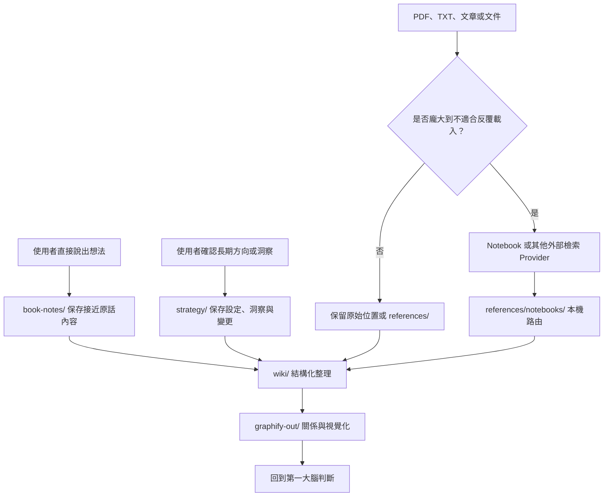
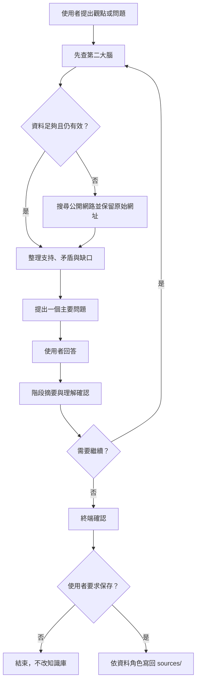

# 系統架構

## 設計目標

`My Real Second Brain` 不以最大資料量為目標，而是區分「第一大腦產生的心得」「外部次級資料」「結構化整理」與「可重建衍生輸出」。

## 五種資料角色

| 角色 | 內容 | 預設位置 |
|---|---|---|
| 策略與已確認洞察 | 使用者確認的一人公司方向、社群策略、限制、優先事項、長期洞察與重要變更 | `sources/strategy/` |
| 第一大腦心得 | 使用者直接說出、親自閱讀、思考或與 AI 討論後形成的內容 | `sources/book-notes/` |
| 次級資料 | 作者文章、PDF、TXT、軟體文件、報告與大型外部資料索引 | `sources/references/` |
| 結構化知識 | Agent 依心得與來源整理、可持續維護的扁平 Wiki | `sources/wiki/` |
| 衍生輸出 | 知識結構 Provider 產生的圖譜、報告與視覺化 | `sources/graphify-out/` |

## 知識生命週期

## 策略與已確認洞察

`sources/strategy/solopreneur-profile.md` 保存一人公司的長期脈絡。它是使用者已確認的方向與限制，不是市場事實，也不代表永遠不變的承諾。

`sources/strategy/social-media-strategy-and-insights.md` 保存社群經營目標、平台角色、內容方向、人工核可原則、分層檢視頻率，以及經人類討論後確認的長期洞察。原始成效資料與逐期報告仍留在實際工作區，只在本檔案保留可追溯位置。

- 第一次啟動、使用者沒有其他明確任務且設定檔尚未完成時，`solopreneur-profile` 才主動引導建立。
- 已有明確任務時不以設定檔阻擋工作。
- 創業方向、定位、客群、產品與優先順序問題，先讀設定檔與既有知識，再決定是否啟動 `socratic-dialogue`。
- 社群策略、內容規劃、平台角色、互動原則或成效判斷問題，同時讀取社群策略檔；檔案尚未設定時不阻擋使用者已提出的明確任務。
- 任何新增或更新都先預覽差異並取得使用者確認；重大變更保留日期與原因。
- 每週、每月、每季與每年報告只能提出候選洞察；加入使用者判斷並再次確認後，才能寫入已確認洞察。
- 公開 repository 只保存空白範本，不保存實際使用者設定。

## 信任與衝突

- 第一大腦心得具有最高的個人知識價值，但可驗證事實仍須比較來源品質、版本與時間。
- 策略設定與已確認洞察提供決策脈絡，但不能取代最新市場證據或使用者當下的明確說法。
- 次級資料用來支持或挑戰心得，不能靜默改寫使用者立場。
- Wiki、Graphify 與 Notebook 是導航、整理與檢索工具，不因結構化程度而自動取得較高權威。
- Graphify 的 `EXTRACTED`、`INFERRED`、`AMBIGUOUS` 標記必須保留。
- Notebook 回答必須保留來源引用，不能只保存 AI 生成的結論。

## 知識詰問

使用者想檢查觀點、挑戰假設或形成決策時，`socratic-dialogue` 先呼叫 `knowledge-source-retrieval` 查第二大腦。只有本機知識不足、可能過時或缺少可信反方時，才搜尋公開網路補充證據。

一次只推進一個主要問題，每二至三次使用者回答後整理一次共識、分歧與待查證事項。對話完成不等於授權寫檔；只有使用者明確要求保存時，才能把確認後的心得、綜合觀點、決策或指定網路來源寫回。

## 外部工具邊界

核心技能依賴 Provider 能力契約，不把 Graphify、Notebook 或特定網路搜尋服務視為永久介面。完整維護規格位於 `docs/providers.md`；可安裝的檢索技能本身也包含最小能力契約，因此安裝到其他工作區後不依賴本 repository 的相對路徑。

替換 Provider 時，讀書筆記、次級資料、Wiki、Notebook 路由與引用 schema 應保持不變；若能力不等價，adapter 必須明確回報。
