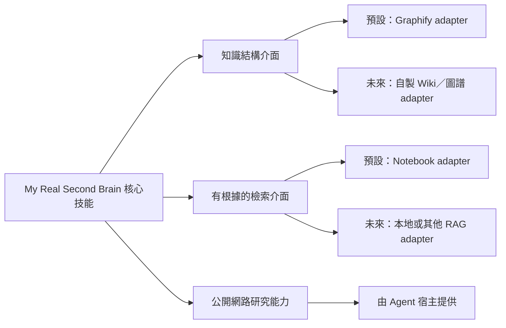

# 可替換後端契約

## 原則

`My Real Second Brain` 的核心是第一大腦心得、次級資料、知識生命週期、來源優先度與引用規則，不是 Graphify 或 Notebook。兩者只是目前預設的後端實作。

## 2026-08-31 版本查證與決策

| Provider | manifest 固定版本 | 查到的最新正式版 | 套件來源 | 授權 | 本次決策 |
|---|---|---|---|---|---|
| Graphify | `graphifyy==0.9.35` | [`0.9.53`](https://github.com/Graphify-Labs/graphify/releases/tag/v0.9.53) | [PyPI 0.9.35](https://pypi.org/project/graphifyy/0.9.35/)、[v0.9.35 release](https://github.com/Graphify-Labs/graphify/releases/tag/v0.9.35) | Apache-2.0，並保留適用的舊 MIT 條款 | 暫時保留固定版本；新版包含行為與安全修正，但尚未在隔離環境完成本技能包相容性與回復測試，不能只因版本較新就升級。 |
| Notebook | `notebooklm-py[browser]==0.8.0` | [`0.8.1`](https://github.com/teng-lin/notebooklm-py/releases/tag/v0.8.1) | [PyPI 0.8.0](https://pypi.org/project/notebooklm-py/0.8.0/)、[v0.8.0 release](https://github.com/teng-lin/notebooklm-py/releases/tag/v0.8.0) | MIT | 暫時保留固定版本；本機既有 0.8.0 CLI 可回報版本與技能狀態，但本次未獲授權進行乾淨安裝、登入或遠端存取，不能視為完整相容。 |

manifest 另保存固定 tag、commit、wheel 與 sdist 的 SHA-256，讓後續外部驗收可以核對下載產物。這些雜湊只證明發行檔識別，不代表套件已在目標電腦成功安裝。

目前兩者都屬於「可選的固定版本候選後端，等待外部驗收」，不是正式支援。未安裝或失效時，技能仍應先回覆本機可取得的知識並清楚說明限制。

## 能力一：知識結構後端

目前預設：Graphify。

後端至少應提供：

- 檢查安裝與健康狀態。
- 從指定本地來源建立或更新結構。
- 查詢節點、關係、路徑與來源。
- 保留抽取、推論與不確定性的標記。
- 提供人類可以探索的視覺化，或明確宣告不支援。
- 偵測過期、異常縮減與不安全重建。

## 能力二：有根據的外部檢索後端

目前預設：Google Notebook，由 `notebooklm-py` 操作。

後端至少應提供：

- 建立及列出知識集合。
- 新增、列出與同步來源。
- 針對指定集合與來源查詢。
- 回傳可追溯的來源 ID、標題與引用。
- 回報同步時間、處理狀態與錯誤。
- 不把登入秘密或大型全文寫入本機索引。

## 能力三：公開網路研究能力

`socratic-dialogue` 在第二大腦資料不足、可能過時或缺少可信反方時，需要使用目前 Agent 可用的公開網路研究能力。這項能力由 Agent 宿主提供，不在 `install.manifest.toml` 鎖定特定搜尋服務。

至少應能：

- 搜尋並開啟公開網頁。
- 優先找到官方文件、原始研究、第一方資料與原始統計。
- 分辨發布日期、更新日期與資料可能過期的風險。
- 在回答中提供可以直接開啟的原始網址。
- 說明每個來源支持、補充或挑戰哪一項說法。
- 無法上網時明確回報限制，不假裝已完成查證。

網路資料預設只用於當次對話。只有使用者明確要求長期保存時，才依 `template/sources/references/README.md` 的格式寫入 `sources/references/`。

## 核心與後端的邊界

核心技能應表達「建立知識結構」「查詢外部集合」「取得引用」，而不是永久寫死某個上游命令。預設 adapter 可以呼叫 Graphify 與 `notebooklm-py`，未來則可以替換成自製 Wiki、其他圖資料庫、本地 RAG 或其他託管服務。

替換 provider 不得要求改寫使用者的讀書筆記、次級資料、Wiki 或來源索引格式；若能力不等價，adapter 必須明確回報差異。

## 更新與回復政策

1. 先查證 PyPI、固定 tag、發行說明與授權，再提出版本變更。
2. 在隔離環境測試套件安裝、專案範圍技能、三種 Agent 發現與既有工作區相容性。
3. 通過後才更新 manifest 的固定版本、commit 與發行檔雜湊。
4. 保留前一個已驗證規格；更新失敗時重新安裝原固定版本並重新驗證。
5. 套件、上游技能、登入狀態、本機索引與遠端資源分開管理，不使用一個「解除安裝」命令推論其他層已移除。
