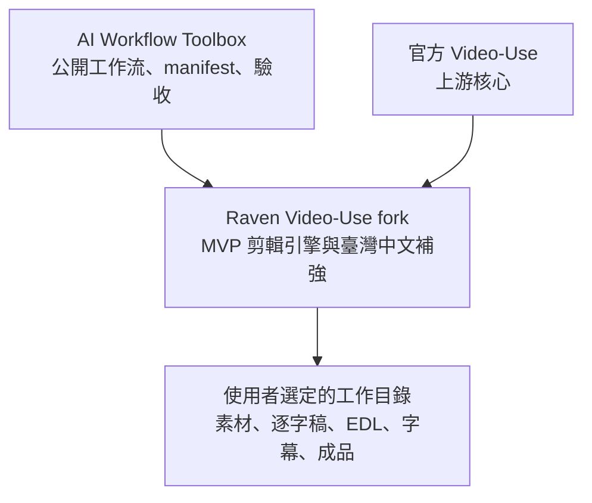

# AI 剪片工作流架構

## 分層

箭頭代表依賴關係，不代表把第三方原始碼或維護者私人資料複製進 Toolbox。Toolbox 透過 manifest 取得已鎖定的 Raven Video-Use v0.1.1 Release 資產，不直接複製 fork 原始碼。

安裝後只保留一份版本化的 fork 目錄。Codex 與 Antigravity 的專案入口是 `<target-workspace>/.agents/skills/video-use`，Claude Code 是 `<target-workspace>/.claude/skills/video-use`；入口連結整個版本目錄，因此三個用戶端讀取相同的 `SKILL.md`、helper 與 lock，不會產生各自漂移的技能副本。

私人剪片流程與公開版本各自演進，不做自動同步。只有維護者明確挑選、完成去識別化、參數化與候選版驗證的能力，才進入下一個公開版本快照。

## 內容歸屬

| 內容 | 唯一來源 |
|---|---|
| 通用剪輯引擎、轉錄 Provider、中文字詞與字幕演算法 | 現階段 Raven Video-Use fork |
| 公開工作流程、安裝契約、確認關卡與驗收 | `skill-packs/ai-video/` |
| 每支影片的素材、逐字稿、EDL、快取與成品 | 使用者指定的工作目錄 |
| 模型權重與工具快取 | 使用者本機的共用快取位置，不進 Git |
| uv 與 Python runtime | 依 manifest 從官方固定資產取得，放在使用者核准的本機工具／runtime 位置，不進 Git |

CKIP 是正式中文字幕的條件式必要依賴：一般剪輯與預覽可以先不安裝；只要輸出正式臺灣繁體中文字幕，就必須以隔離 runtime 執行固定 revision 的 CKIP 斷詞與詞性模型。不同意安裝時，流程必須停在預覽狀態，不得把未驗證詞界的字幕當成正式交付。

## MVP 流程邊界

公開套件負責從素材盤點到可交付影片的本機流程。平台上傳、發布、排程、付費 API、自動社群分發及特定品牌成品不在 MVP 範圍。

每個可能改變內容、下載大型模型、安裝工具、覆寫檔案或產生費用的步驟，都必須先預覽並取得使用者確認。技術 QA 通過不等於人工觀看／聆聽驗收，也不等於已發布。

## 演進方向

MVP 先以 fork 降低重構成本。未來只有在中文能力能透過穩定介面獨立安裝，且與 fork 通過相同驗收案例後，才切換為官方 Video-Use＋Raven 臺灣中文擴充套件。
