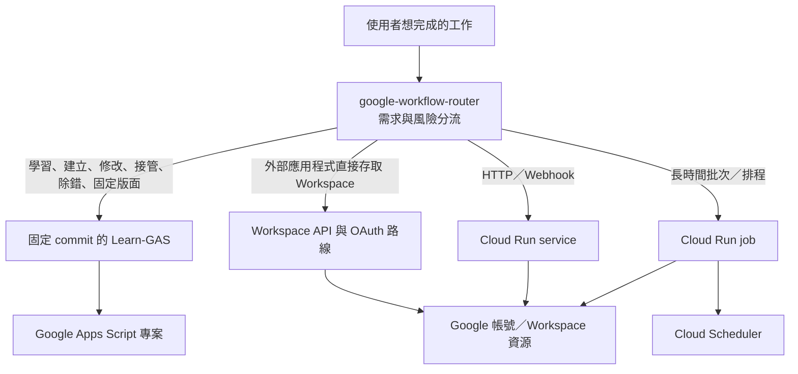

# Google 工具自動化架構

## 元件關係

箭頭代表工作分流與執行依賴，不代表 Toolbox 會建立帳號、OAuth client、Cloud Project 或部署服務。

## 唯一來源

| 內容 | 唯一來源 |
|---|---|
| 跨 Apps Script、Workspace API 與 Cloud Run 的判斷 | `skills/google-workflow-router/` |
| Apps Script 教學、專案、除錯與 Docs 固定版面 | manifest 固定的 Learn-GAS commit |
| 安裝狀態、雜湊與回復記錄 | 使用者指定、位於技能掃描目錄外的本機狀態目錄 |
| OAuth 憑證、Token、Cookie、Script ID、Cloud Project ID | 只存在於對應工具的安全位置；不得進入 Toolbox 狀態或 Git |
| 使用者的程式、測試與文件 | 使用者選定的專案目錄 |

## 安裝分層

安裝管理器會把一個 Toolbox 路由技能、Learn-GAS 四個技能與共用術語檔複製到明確指定的技能根目錄。每個入口都有內容雜湊，狀態檔放在技能掃描目錄外。

- 正常安裝：目標不存在才新增；內容完全相同時可安全重跑。
- 衝突：未知檔案、symlink、人工修改或來源驗證失敗時停止。
- 更新：先保留目前版本的可回復副本，再替換全部受管理入口。
- 回復：只從已記錄且雜湊相符的備份還原。
- 移除：先驗證目前內容，再移到狀態目錄的隔離區；不刪除來源 repository、使用者專案或 Google 資源。

安裝器不下載依賴。Agent 必須先把 Learn-GAS 的固定 commit 取得到新的本機目錄、完成驗證，再把該目錄傳給安裝器。

## 五個完成狀態

| 狀態 | 證據 | 不能推論 |
|---|---|---|
| 本機程式完成 | 檔案、測試、靜態檢查與本機 commit | 已登入或已上傳 |
| Google 帳號登入 | 唯讀命令或使用者可見的目前帳號 | 已取得需要的 OAuth 權限 |
| OAuth 授權 | 實際 scope 與授權結果 | 程式已部署或可正確執行 |
| 遠端部署／同步 | 遠端版本、URL、檔案或服務狀態讀回 | 業務成果正確 |
| 人工驗收 | 使用者看到實際 Workspace／Cloud 結果並確認 | 可以自動公開、擴權或計費 |

任何報告都必須逐項記錄，不可把前一項通過寫成後面全部完成。
