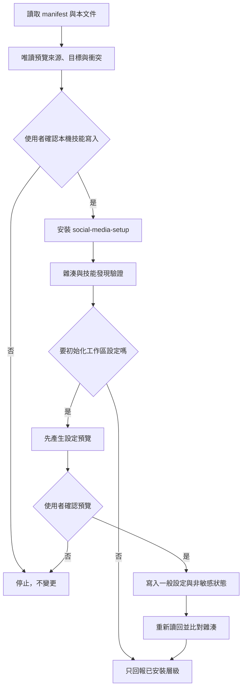

# 本機候選版安裝

目前只安裝 `social-media-setup`。安裝管理器不連網、不登入平台、不安裝套件，也不初始化任何真實平台連線。



## 安裝前檢查

1. 閱讀 `AGENTS.md`、本文件、`install.manifest.toml` 與 `docs/verification-levels.md`。
2. 選擇明確的 Agent 技能目錄與位於技能掃描目錄外的狀態目錄。
3. 執行 `status` 做唯讀檢查，說明會新增的單一技能與所有同名衝突。
4. 取得使用者對「本機技能寫入」的明確確認後，才能執行 `install`。

範例路徑只使用佔位符：

```text
python3 scripts/manage_install.py status \
  --registration agents_workspace \
  --client-root <workspace>/.agents/skills \
  --state-root <local-state-root>
```

支援 `install`、`update`、`rollback`、`remove` 與 `status`。不同內容的同名入口、人工修改過的受管理技能、symlink 或損壞狀態一律停止；`remove` 只移至可回復隔離區。

## 工作區設定

`scripts/manage_workspace.py` 將預覽與寫入拆成兩個命令：

1. `preview` 驗證候選 JSON、列出差異並回傳預覽雜湊，不寫檔。
2. 使用者確認預覽後，`apply` 必須同時收到該雜湊與 `--confirm-write` 才能寫入。
3. 既有設定若在預覽後變動，雜湊會失效並停止。
4. 寫入後重新讀回；一般設定與非敏感狀態都明確標示不含憑證。

命令列旗標只是防誤用機制，不取代 Agent 在對話中取得使用者確認。

安裝會一併複製 `oauth_callback.py`、`oauth_runtime.py`、`oauth_http.py` 與其契約／schema，不會執行它們。Facebook Pages／YouTube 的實際接收、交換與有效性操作依 [OAuth 執行契約](skills/social-media-setup/references/oauth-runtime.md)；Facebook HTTPS 入口不是由安裝器建立，Instagram／Threads 不共用 Facebook 執行器。

安裝技能不會自動建立任何平台 App，也不會在安裝時建立、讀取或刪除作業系統憑證。日後使用平台整合模式時，Agent 對已選平台預設提出所有已支援核心功能的完整權限，逐項說明用途與刪減影響，並在 OAuth 前讓使用者移除；廣告、企業資產、商品、商務等延伸權限只列為選項。選取 Meta 任一平台時，一次詢問是否也設定 Facebook、Instagram 與 Threads，但逐平台保存 App／use case、permission、OAuth 與驗證證據。

使用者沒有指定秘密管理工具時，外部變更預覽預設列入目前作業系統帳號的 macOS Keychain 或 Windows Credential Manager。Agent 可直接保存 OAuth callback 取得的 Token；平台強制讓人取得 App Secret／API key 時，Agent 在可見 Terminal 開啟不回顯的輸入程式，使用者只貼上一次。`.local/social-media/credential-references.json` 只有非敏感參照。技能移除不會連帶刪除系統憑證；逐筆刪除必須另行預覽與確認。Agent 必須先顯示外部變更預覽並取得授權，才可操作官方開發者後台、設定 OAuth、保存憑證與執行正式 API 唯讀驗證。目前原生憑證庫及所有真實帳號驗收仍未執行。
