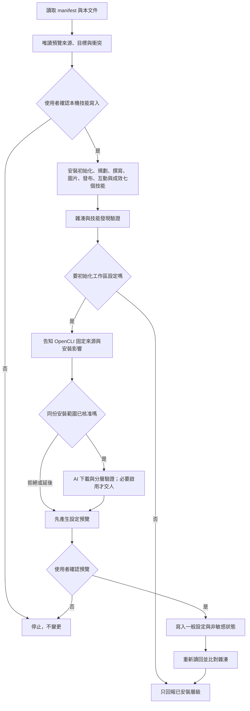

# 本機候選版安裝

目前安裝 `social-media-setup`、`social-content-planning`、`social-content-writing`、`social-image-production` 、`social-content-publishing` 、`social-community-management` 與 `social-performance-analysis` 七個本機候選。安裝管理器不連網、不登入平台、不安裝第三方套件，也不初始化任何真實平台連線。

十個虛構對話回合已由目前 root Agent 直接套用七份技能來源，並以 `tests/test_agent_dialogue_preflight.py` 檢查可觀察回應；這不代表安裝後的真實 Agent 已發現技能，也不是獨立模型驗收。驗證紀錄見 `docs/agent-dialogue-preflight-local-verification.md`。

圖片技能會一併安裝四路集中驗收的虛構簡報、完整網頁提示詞、安全 HTML 原稿、溢位負例與分層結果範本；安裝只複製檔案，不會呼叫 Codex、Antigravity、瀏覽器、renderer、下載字型或生成圖片。準備狀態見 `docs/image-acceptance-preparation-local-verification.md`。

七技能本機候選的交付範圍、整包回歸數字與仍未執行的集中實機層級，以 `docs/local-candidate-handoff.md` 為準；未來實測依 `docs/live-acceptance-runbook.md` 逐層取得授權並將結果寫入 `docs/live-acceptance-result-template.json` 的副本。安裝成功只代表受管理檔案進入指定入口，不會把候選狀態提升為真實帳號、外部寫入或正式公開支援。

技能檔案安裝完成後，若使用者要求實際初始化專案，預設依 [OpenCLI 初始化流程](skills/social-media-setup/references/opencli-initialization.md) 準備瀏覽器工具。下載前先告知官方作者 GitHub、固定來源與影響，取得同份安裝預覽的一次確認；AI 代辦下載、核對、建置與能操作的啟用步驟。這不是由本檔的離線安裝器偷偷下載，也不代表任何社群登入或發布授權。



## 安裝前檢查

1. 閱讀 `AGENTS.md`、本文件、`install.manifest.toml` 與 `docs/verification-levels.md`。
2. 選擇明確的 Agent 技能目錄與位於技能掃描目錄外的狀態目錄。
3. 執行 `status` 做唯讀檢查，說明會安裝的七個技能與所有同名衝突。
4. 取得使用者對「本機技能寫入」的明確確認後，才能執行 `install`。

範例路徑只使用佔位符：

```text
python3 scripts/manage_install.py status \
  --registration agents_workspace \
  --client-root <workspace>/.agents/skills \
  --state-root <local-state-root>
```

支援 `install`、`update`、`rollback`、`remove` 與 `status`。不同內容的同名入口、人工修改過的受管理技能、symlink 或損壞狀態一律停止；`remove` 只移至可回復隔離區。

候選版本 `0.7.0` 可由一至六技能版 `0.1.0` 至 `0.6.0` 使用新版管理器執行 `update`；先確認新增入口沒有其他同名技能。`rollback` 回到舊技能集合快照時會移除未被修改的新增技能入口，不留下仍可被發現的殘留；新技能有人工修改時停止。上述操作只影響受管理技能，私人研究、內容行事曆與憑證不隨技能移除。版本號只表示本機候選，尚未發布。

發布技能複製五份平台文件、標準函式庫 `publish_job.py`、`official_publish_api.py` 與 `publish_execute.py`，安裝過程不執行它們，也不呼叫外部寫入。YouTube、Facebook、Instagram、Threads 由交易協調器串接低階官方 API adapter，不安裝 SDK；Substack 選定由 Agent 使用已核准 OpenCLI 操作受控 Chrome，協調器只產生 handoff、寫入 claim 與 receipt。這些只通過虛構本機測試，不建立背景排程，也不等於實機發布已驗收。安裝移除／回復不清除私人發布 ledger、稿件、證據或原生憑證。

互動技能複製五份平台文件、公開留言的六欄審核／人工安全審查契約、community_queue.py、manual_review.py、Sheets／平台 adapter 與交易協調器；也包含 Facebook／Instagram 按需私訊的獨立 queue、官方 adapter、交易協調器及執行契約。私訊只有使用者明確叫 Agent 時才同步，只處理對方先發起且 24 小時內的純文字，不進 Google Sheets、不建 Webhook。人工審查只用標準函式庫並綁本機回環位址；不安裝或啟用 AI 分類器，不安裝 Sheets／平台 SDK，不建立排程或改權限。跨元件完整虛構測試是開發驗證檔，不會由安裝器執行或複製成使用者資料；私人 social-media/community/ 與雲端審核表不由安裝器建立、修改、回復或清除。

成效技能複製五份平台文件、metric-catalog.json／metric_catalog.py、唯讀 API adapter、來源收集器與離線分析／策略寫回 helper。安裝器只複製檔案，不查 API、不建立 MCP connector、不匯出私人資料。指標目錄會限制 YouTube 白名單與來源時區、Facebook／Instagram 當次欄位說明、Threads 曆期排除項目及 Substack 來源資格；它不代表真實帳號、權限、指標資料或涵蓋已通過。

## 工作區設定

新的一般設定採 schema 5，另包含 brand_visual 品牌視覺，並保留圖片製作偏好：Codex、Antigravity、網頁模型或 HTML＋CSS，以及資訊密集圖卡的分流。初始化時一次預覽確認，後續不每次問；網頁代操作仍限當次明確要求。舊 schema 3／4 不自動遷移，維持可讀，保存新偏好時只補缺少欄位並保留原策略／整合／製圖偏好，使用相同 preview／apply 確認流程。不因安裝新版技能就改使用者設定或執行生圖。

圖片技能會一併複製 image_assets.py、簡報範本與紀錄契約，不執行渲染。執行文字排版／解碼 helper 需要既有 Pillow 與適用字型；沒有依賴就停在該能力，不影響純技能檔案安裝。Pillow 的新安裝契約尚未就緒，manifest 明列 installable=false；技能安裝器不下載模型、字型或 Pillow。安裝通過不代表 AI 生圖或中文字形驗收通過。

`scripts/manage_workspace.py` 將預覽與寫入拆成兩個命令：

1. `preview` 驗證候選 JSON、列出差異並回傳預覽雜湊，不寫檔。
2. 使用者確認預覽後，`apply` 必須同時收到該雜湊與 `--confirm-write` 才能寫入。
3. 既有設定若在預覽後變動，雜湊會失效並停止。
4. 寫入後重新讀回；一般設定與非敏感狀態都明確標示不含憑證。

命令列旗標只是防誤用機制，不取代 Agent 在對話中取得使用者確認。

安裝會一併複製 `oauth_callback.py`、`oauth_runtime.py`、`oauth_http.py`、`meta_user_oauth.py`、`instagram_facebook_oauth.py` 與其契約／schema，不會執行它們。Facebook Pages、YouTube、Instagram Login、Instagram via Facebook Login 與 Threads 的實際接收、交換與有效性操作依 [OAuth 執行契約](skills/social-media-setup/references/oauth-runtime.md)；Meta HTTPS 入口不是由安裝器建立。兩條 Instagram 登入路線必須明確區分，不共用 Token 或身分假設。

安裝技能不會自動建立任何平台 App，也不會在安裝時建立、讀取或刪除作業系統憑證。日後使用平台整合模式時，Agent 對已選平台預設提出所有已支援核心功能的完整權限，逐項說明用途與刪減影響，並在 OAuth 前讓使用者移除；廣告、企業資產、商品、商務等延伸權限只列為選項。選取 Meta 任一平台時，一次詢問是否也設定 Facebook、Instagram 與 Threads，但逐平台保存 App／use case、permission、OAuth 與驗證證據。

使用者沒有指定秘密管理工具時，外部變更預覽預設列入目前作業系統帳號的 macOS Keychain 或 Windows Credential Manager。Agent 可直接保存 OAuth callback 取得的 Token；平台強制讓人取得 App Secret／API key 時，Agent 在可見 Terminal 開啟不回顯的輸入程式，使用者只貼上一次。`.local/social-media/credential-references.json` 只有非敏感參照。技能移除不會連帶刪除系統憑證；逐筆刪除必須另行預覽與確認。Agent 必須先顯示外部變更預覽並取得授權，才可操作官方開發者後台、設定 OAuth、保存憑證與執行正式 API 唯讀驗證。目前原生憑證庫及所有真實帳號驗收仍未執行。

成效技能包含五份平台指標文件、四週期與人工寫回契約、來源 collector、指標目錄及 performance_review.py，只用 Python 標準函式庫，不安裝資料擷取 SDK。隔離虛構測試會讓四週期各自走完收集、觀察、單一問題、人工判斷、預覽、再次確認寫回及讀回；這不等於真實 Agent 或平台驗收。私人 social-media/performance/、.local/social-media/performance/ 與 sources/strategy/social-media-strategy-and-insights.md 不由技能安裝器建立、更新、回復或移除。full_pack 只表示七個技能結構齊備，不代表所有外部能力已實作或驗收。
