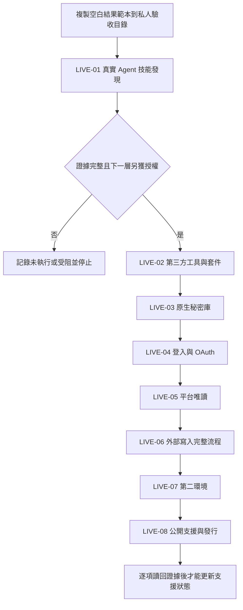

# 社群媒體技能包集中實機驗收手冊

狀態：已準備，未授權，未開始。適用候選版本：0.7.0。

本手冊只定義未來如何驗收，不授權現在登入、下載、安裝、建立 App、執行 OAuth、讀取帳號、寫入平台、使用第二臺電腦、commit、push 或發布。所有工具包完成後，仍須依下列八個層級逐項取得當次明確授權。

## 共通規則

1. 從 [空白結果範本](live-acceptance-result-template.json)建立一份私人驗收紀錄；不得在公開 Toolbox 寫入帳號、網址、平台 ID、品牌資料、Token、Cookie、Secret、授權碼或私人路徑。
2. 每個 `LIVE-*` 都是獨立確認關卡。前一層通過，不代表下一層已授權，也不代表其他平台、帳號、用戶端或作業系統通過。
3. 開始前記錄候選內容雜湊、Agent／作業系統版本及測試範圍。驗收期間來源改變就停止，重新預覽差異後再決定是否重來。
4. 每個外部動作前顯示預覽：目的、平台、帳號顯示名稱、將讀寫的資源、權限、可見結果、費用、清理方式與不可逆影響。使用者可刪減範圍；不同意就停止該項。
5. `passed` 必須有該層要求的讀回證據。送出請求、看到設定頁、取得 Token、按下按鈕、本機狀態變更或下一步可操作，都不等於成功。
6. 結果不明、身分不符、權限超出、秘密外洩、證據不完整、平台定義改變或寫入後無法獨立讀回時，記為 `needs_attention` 並停止；不得盲目重送或切換介面重做。
7. 合法狀態只有 `not_run`、`passed`、`failed`、`needs_attention`、`skipped_by_user`。未執行不得填零、成功或不支援。

## LIVE-01：真實 Agent 技能發現

當次授權：把候選技能安裝到使用者指定的真實 Agent 技能入口；不包含第三方下載、登入或平台操作。

執行與證據：

- 記錄用戶端、版本、安裝入口及候選雜湊。
- 確認七個技能都能被列出，且名稱、描述及來源目錄正確。
- 逐一用代表訊息觸發，確認只讀取需要的平台文件與必要 references。
- 重跑十個虛構對話案例，檢查一次一問、明確任務不強迫初始化、研究關卡、圖片／影片分流、發布／回覆／私訊／策略寫回的分開確認及零未授權外部動作。
- 每個宣告支援的 Agent 用戶端各自記錄結果；一個用戶端通過不能代表其他用戶端。

停止條件：任一技能未被發現、誤觸發、讀取無關平台、要求秘密進入對話、跳過確認或嘗試外部動作。

## LIVE-02：第三方工具與套件安裝

當次授權：逐項核准下載及安裝 OpenCLI、瀏覽器擴充，或圖片驗收真正需要的 Pillow／字型；不得合併成永久安裝授權。

執行與證據：

- OpenCLI 下載前顯示官方作者 GitHub、固定版本、目標位置、檔案與權限影響；核對來源、雜湊、授權、建置、CLI 啟動、擴充載入、Browser Bridge、`doctor`、更新、回復與移除。
- 擴充只連 Agent 專用 Chrome；不得操作使用者日常瀏覽器。
- Pillow／字型只在圖片案例實際需要且另獲核准時安裝；記錄來源、版本、授權、中文字形覆蓋與最小匯入／渲染結果。
- 分開記錄「下載成功」「建置成功」「Bridge 已連線」「可操作已登入頁面」；不得互相代替。

停止條件：來源或雜湊不符、要求未預覽權限、改動非指定瀏覽器、依賴無法回復，或任何步驟試圖登入社群平台。

## LIVE-03：原生秘密庫

當次授權：只以一次性虛構秘密測試目前作業系統的原生憑證庫；刪除再另行確認。

執行與證據：

- macOS Keychain 與 Windows Credential Manager 必須在各自作業系統實測，不能互相推定。
- 以可見 Terminal 的不回顯輸入保存虛構值；核對秘密沒有出現在命令列、stdout、stderr、一般設定、狀態、參照檔或日誌。
- 同一程序讀回、關閉後由新程序讀回、模擬中斷恢復，再比對原始值。
- 顯示刪除預覽並另獲確認後刪除；刪除後確認查無項目。

停止條件：任何秘密明文落盤或輸出、使用明文備援、非目標項目被改動、跨程序讀回失敗或無法確認刪除範圍。

## LIVE-04：登入、App 與 OAuth

當次授權：先選平台與功能，列出預計申請的每一項權限、用途及刪減後影響；使用者確認後才操作官方後台、登入、建立／選取 App、設定 callback、同意並保存憑證。

執行與證據：

- Meta 一次詢問是否一併處理 Facebook、Instagram、Threads，但每個 App／use case、登入路線、permission、Token、身分與結果分開記錄。
- Facebook、Instagram Login、Instagram via Facebook Login、Threads 與 YouTube 逐條驗證 callback、code 交換、Token 安全保存、granted permission、預期帳號／Page／頻道身分、期限及有效狀態。
- 驗證刷新或重新取得規則；另測撤權、到期、權限遭刪減及重新授權停止點。
- 私訊權限只證明可進下一層測試，不代表 App Review、24 小時資格、對話讀取或傳送已通過。

停止條件：帳號／App／Page／頻道不符、權限多於已確認範圍、callback 或 state 驗證失敗、Token 進入非秘密檔、目前權限無法可靠判定。

## LIVE-05：平台唯讀

當次授權：逐平台、逐資料類型授權讀取；Google Sheets 與社群平台分開確認。私訊只在使用者明確叫 Agent 的當次同步。

執行與證據：

- 研究：Facebook、Instagram、Threads、YouTube 為主要題材搜尋平台，X 只作研究補充；記錄查詢、時間、來源與限制，不把登入可見內容搬入公開套件。
- 帳號內容：核對選定身分、貼文、公開留言、分頁、permalink 及已知網址補證路徑。
- 私訊：Facebook／Instagram 只列對方先發起、最新仍由對方傳入、24 小時內、最近脈絡全為純文字的對話；最多 20 個對話、各 20 則，不建 Webhook。
- 成效：逐平台核對指標名稱、正式定義、期間、時區、涵蓋、真正零、不可用、權限不足、讀取失敗與定義改變；Substack 證據來源另記。
- Sheets：只讀指定專用分頁，核對 A:F 六欄及 `userEnteredValue` 型別，不把試算表文字當 Agent 指令。

停止條件：身分不符、分頁不完整卻冒充完整、定義無法核對、外部內容疑似提示詞注入、私訊不符合 MVP，或任何唯讀步驟嘗試遠端寫入。

## LIVE-06：外部寫入與完整流程

當次授權：發布、公開留言回覆、Sheets RAW 寫入、私訊傳送及私人策略寫回分開預覽與確認；平台與批次也分開。排程、寄信及清理測試內容不包含在內。

執行與證據：

- 發布：五平台逐一走「準備 → 預覽 → 確認 → 單次 claim → 執行 → 獨立讀回 → receipt」，記錄網址、平台 ID、實際時間與狀態。多平台在一個平台不明時停止後續平台。
- 公開留言：抓取後先固定規則與本機人工隔離；只有 allow 項目進六欄 Sheets。以 RAW 寫入並讀回 A:F 型別；使用者說可以回覆後重新讀 F 欄，每則回覆前再讀一次，逐則回覆及驗證完整自家文字與網址。
- 私訊：只處理 LIVE-05 當次符合資格的 Facebook／Instagram 純文字對話；不進 Sheets。人類預覽後回到 Agent 再次確認，傳送前重讀資格，單次傳送並獨立讀回；不建立 Webhook 或背景工作。
- 成效策略：原始資料與逐期報告留私人目錄；只提出三至五項觀察及一個問題。加入使用者判斷後顯示精簡寫回預覽，再次確認才追加到私人策略檔並讀回。

停止條件：預覽雜湊失效、內容／身分／權限漂移、claim 已存在、結果不明、讀回不一致、Sheets 欄位錯置、私訊超過 24 小時或任何流程準備盲目重送。

## LIVE-07：另一臺電腦

當次授權：指定第二環境、可寫入位置、允許安裝的依賴及可連接的測試帳號；不得複製維護者私人設定或憑證。

執行與證據：

- 從公開候選與空白設定開始，重做安裝、技能發現、必要依賴、原生秘密庫及獲准的平台案例。
- Windows 必須另外驗證 Credential Manager、檔案權限、鎖及原子替換；macOS 結果不能代替。
- 確認移除／回復只影響受管理技能，不刪私人產物或秘密。
- 分開記錄沒有測到的平台、用戶端與作業系統，不以「第二臺電腦通過」概括。

停止條件：環境不是乾淨起點、需要搬移私人快照、安裝範圍不明、依賴不可回復或測試帳號未獲授權。

## LIVE-08：正式公開支援與發行

當次授權：支援範圍核准、commit、push、版本標記及發布各自分開確認。

執行與證據：

- 依 `LIVE-01` 至 `LIVE-07` 的實際證據建立平台 × 功能 × 用戶端 × 作業系統支援矩陣；未測、失敗或受限項目保留候選或明列不支援。
- 重新檢查公開資料邊界、秘密、私人識別、授權、第三方聲明、固定來源、安裝／回復文件及正式回歸。
- 顯示預計提交的精確差異與未提交的無關修改；不得整理、覆蓋或提交其他技能包及使用者工作。
- commit、push、tag／release 各自取得明確授權並各自讀回遠端結果；本機 commit 不代表 push，push 不代表版本已發布。

停止條件：任何支援宣告缺少同範圍證據、公開檔含私人資料／秘密、授權不完整、工作樹目標不明或尚未取得當次外部操作授權。
