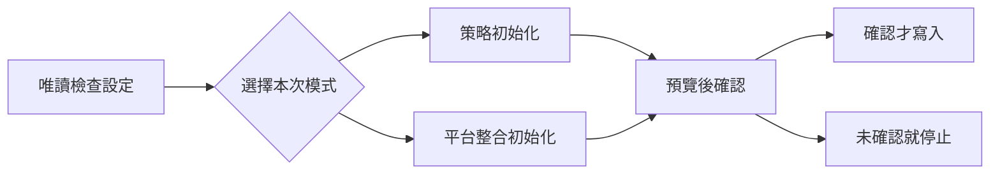
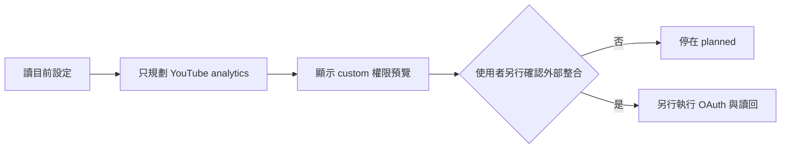
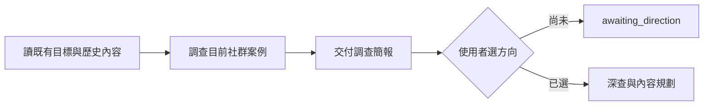
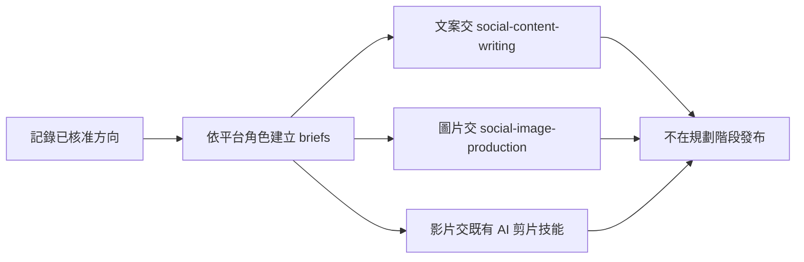
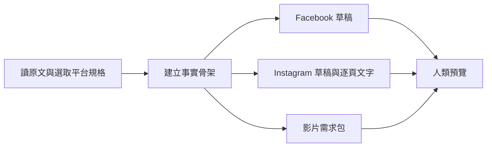
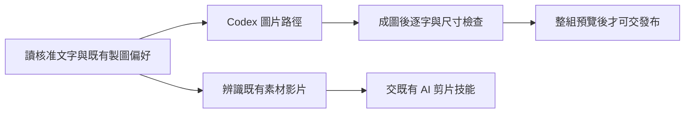
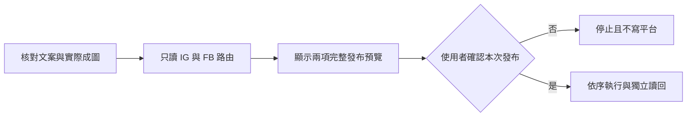
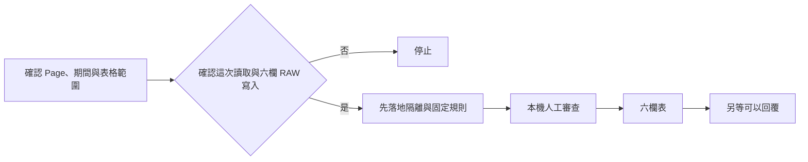
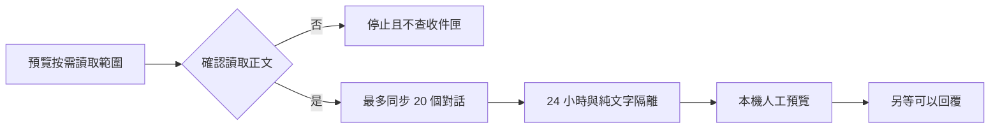
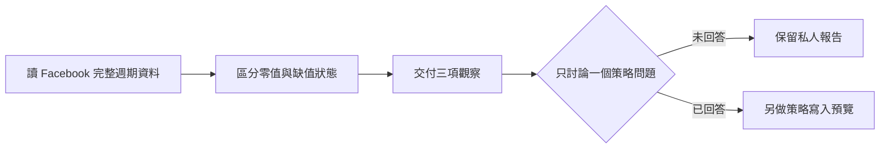

# 七技能虛構 Agent 對話前測紀錄

日期：2026-09-06。以下是目前工作階段的 root Agent 完整讀取七份 `SKILL.md` 後，依既有案例進行的直接前向演練。平台回應、帳號、工作區與內容都是虛構；工具層只提供明示的假狀態，沒有網路、登入、OAuth、平台讀寫、模型生成、第三方安裝或私人工作區存取。

這份紀錄證明的是「給定虛構脈絡時，這一次 Agent 回應有遵守觸發與交接」。它不是獨立模型測試，也不證明技能已在任何真實 Agent 安裝入口被發現。後者仍屬集中實機驗收。

## CASE setup-one-question

技能：social-media-setup  
來源案例：behavior-cases 1  
平台文件：無  
外部動作：無

### 使用者

我想開始經營社群。

### Agent 回應

目前沒有明確任務，我先不建立 App、不啟動 OAuth，也不一次問完整問卷。你這次想先釐清經營策略，還是先設定某一個平台的管理功能？

### 操作紀錄

只辨識設定技能；沒有讀平台文件、沒有建立候選設定，也沒有執行外部動作。

## CASE setup-explicit-youtube

技能：social-media-setup  
來源案例：behavior-cases 2、8  
平台文件：youtube  
外部動作：無

### 使用者

請在虛構工作區準備讀取 YouTube 每週觀看資料；其他平台與發布功能先不要設定。

### Agent 回應

本次範圍已明確，我只建立 `YouTube × analytics` 的 custom 整合規劃，保留其他策略欄位的原狀；不要求補完五平台、發布權限或完整內容策略。這一輪只產生權限與設定預覽，登入、OAuth、平台讀取都維持獨立且尚未執行。

### 操作紀錄

只讀 YouTube 平台文件；沒有讀 Meta 或 Substack 文件，沒有安裝、登入或寫入。

## CASE planning-research-first

技能：social-content-planning  
來源案例：content-planning-cases 1、2、4  
平台文件：facebook,instagram,threads,youtube,x  
外部動作：無

### 使用者

請規劃「AI Agent 是什麼」的社群內容。虛構工具結果提供 Facebook、Instagram、Threads 各一個可讀案例；YouTube 是其中一篇的重複轉貼，X 搜尋受限。

### Agent 回應

調查簡報：

- 案例 1／Facebook：以「Agent 與聊天機器人的差異」切入，適合建立基本概念；目前只能確認虛構原文與發布日，互動數不是市場代表值。
- 案例 2／Instagram：用五張輪播拆解「目標、工具、記憶、行動、確認」，角度偏視覺教學。
- 案例 3／Threads：從日常工作委派失敗談 Agent 邊界，角度偏經驗與討論。
- YouTube 結果是案例 1 的重複轉貼，因此不另算第四個獨立案例。
- X 搜尋受限，只記錄 `limited`；不能據此宣稱沒有人談過。

目前方向狀態是 `awaiting_direction`，尚未建立行事曆、定案題目或製作交接。你想優先做「初學者概念拆解」，還是「從實際委派失敗理解 Agent 邊界」？

### 操作紀錄

讀取五個研究來源的虛構結果，但沒有登入、補湊案例、查其他私人檔案或建立發布目的地。

## CASE planning-approved-handoff

技能：social-content-planning  
來源案例：content-planning-cases 3、8  
平台文件：instagram,youtube,substack  
外部動作：無

### 使用者

我看過調查了，採用「從實際委派失敗理解 Agent 邊界」，做 Instagram 輪播、YouTube 影片與 Substack 長文。

### Agent 回應

方向已綁定本次調查版本。Instagram brief 使用輪播呈現「失敗情境 → 邊界 → 正確委派」；YouTube brief 使用完整案例與操作示範；Substack brief 保留原因、限制與可重複方法。三份文案 brief 交給 `social-content-writing`，輪播視覺 brief 交給 `social-image-production`，影片剪輯需求交給既有 AI 剪片技能。這裡只形成製作交接，不建立遠端排程，也不發布。

### 操作紀錄

只讀被選取的三個目的地規格；X 沒有變成發布平台，沒有呼叫後續技能或遠端工具。

## CASE writing-direct-drafts

技能：social-content-writing  
來源案例：content-writing-cases 1、5  
平台文件：facebook,instagram  
外部動作：無

### 使用者

把這篇虛構的 AI Agent 入門文章改成 Facebook 貼文與 Instagram 三頁輪播；另外整理一份有素材剪輯的影片需求。

### Agent 回應

Facebook 草稿以一段工作委派失敗開場，說明 Agent 會依目標使用工具並採取多步行動，結尾邀請讀者分享最想委派的工作。Instagram 輪播文字分成：第 1 頁「AI Agent 不只是聊天」、第 2 頁「它會依目標選工具與行動」、第 3 頁「重要動作仍要保留人工確認」。影片需求標為「已有素材剪輯」，交付段落順序、字幕重點與缺少的鏡頭，不把它改成 AI 新影片生成。

以上都是草稿與媒體需求，尚未生成圖片、剪輯影片或發布；文案核准也不會自動取得媒體或發布授權。

### 操作紀錄

只讀 Facebook、Instagram 文案規格；沒有要求初始化、重新調查五平台、呼叫模型或打開平台編輯器。

## CASE image-and-video-routing

技能：social-image-production  
來源案例：image-production-cases「要求圖片及影片」與四種方式設定  
平台文件：instagram  
外部動作：無

### 使用者

設定已指定一般圖片用 Codex。請把核准的三頁文字做成 Instagram 輪播，也把我現有的錄影剪成 Shorts。本案例只前測路由，不實際呼叫模型或剪輯工具。

### Agent 回應

圖片需求沿用已保存的 Codex 路徑，不再詢問製圖方式或要求重新初始化；實際工作時會直接開始三頁輪播製作，再逐張檢查繁體中文、順序與尺寸。現有錄影不屬於圖片技能，會把剪輯需求、素材位置與 Shorts 目的交給既有 AI 剪片技能；不把它誤送成 AI 新影片生成。這次前測不呼叫模型或剪輯工具，也不交給發布技能。

### 操作紀錄

只讀 Instagram 圖片需求與既有 Codex 偏好；圖片與影片分流正確，沒有改設定或產生外部動作。

## CASE publishing-selected-platforms

技能：social-content-publishing  
來源案例：content-publishing-cases「把核准圖卡發到 IG 和 FB」  
平台文件：instagram,facebook  
外部動作：無

### 使用者

把核准的三頁輪播發到虛構 Instagram 帳號，並把第一張與 Facebook 文案發到虛構 Facebook 粉絲專頁。

### Agent 回應

發布預覽：Instagram 使用已核准三頁輪播、既定順序與完整 caption；Facebook 使用第一張成圖與已核准貼文。兩者都是立即發布，目的帳號、可見性、通知選項與執行介面須在實際預覽中完整列出；本案例沒有核准寄信、排程或其他平台。文案與圖片核准不等於發布授權，因此我現在不建立容器、不上傳，也不按發布。你確認要依這份 Instagram／Facebook 預覽產生外部貼文嗎？

### 操作紀錄

只讀 Instagram 與 Facebook 發布文件；沒有讀 YouTube、Threads、Substack 文件，沒有 begin、claim 或遠端寫入。

## CASE community-public-comments

技能：social-community-management  
來源案例：community-management-cases 1、5、31  
平台文件：facebook  
外部動作：無

### 使用者

整理虛構 Facebook 粉絲專頁昨天的公開留言，使用已指定的空白審核分頁。

### Agent 回應

這次只讀指定粉絲專頁昨天的自有貼文公開留言，先寫入私人隔離區；固定規則與本機人工審查通過後，才把六個固定欄位以 RAW 寫入已指定的空白分頁。這次範圍不包含回覆、刪除、隱藏、封鎖或私訊；日後即使你在第六欄改好文字，仍要在對話中針對該批次另說可以回覆。你確認現在進行這次留言讀取與六欄表格寫入嗎？

### 操作紀錄

只讀 Facebook 留言文件；尚未抓取留言、寫入 Sheets 或取得任何回覆 claim。

## CASE community-facebook-dm

技能：social-community-management  
來源案例：community-management-cases 49、51、52  
平台文件：facebook  
外部動作：無

### 使用者

幫我看看虛構 Facebook 粉絲專頁的私訊。

### Agent 回應

我只會按這次要求讀取指定粉絲專頁，最多 20 個對話，且會讀取必要的私訊正文。第一版不建立 Webhook、不背景同步、不排程；只有對方先發起、最新仍是對方訊息、未超過 24 小時且最近脈絡全為純文字的對話，才會進本機人工審查。私訊不進 Google Sheets，也不會因已有 `pages_messaging` 就自動回覆。你確認現在讀取這個虛構 Page 的上述私訊範圍嗎？

### 操作紀錄

只讀 Facebook 私訊文件；尚未同步正文、建立回覆批次或傳送訊息。

## CASE performance-one-question

技能：social-performance-analysis  
來源案例：performance-analysis-cases 1、6、12、17  
平台文件：facebook  
外部動作：無

### 使用者

看看虛構 Facebook 粉絲專頁上週成效。假資料顯示完整期間觀看為 0、前期為 12；留言資料不可用；分享因權限不足；角色設定是公開討論。

### Agent 回應

觀察 1：完整來源中的觀看數由前期 12 變為本期真正的 0；這是可比較的下降，不是資料遺失，但單一觀看指標不能解釋原因。  
觀察 2：留言狀態是「資料不可用」，不能補成 0，也不能據此說討論消失。  
觀察 3：分享資料是「權限不足」，與資料不可用不同；在補足權限前不計算分享增減，也不要求重新初始化其他功能。

這三項只適用該粉絲專頁的相鄰完整週期，不和其他平台做數值排名。目前只交付私人報告，沒有寫入長期策略。上週是否有停更、改題材或調整投放，足以改變我們對觀看下降的判讀？

### 操作紀錄

只讀 Facebook 成效文件與虛構資料；沒有跨平台加總、寫入策略、建立排程或啟動下一個技能。

