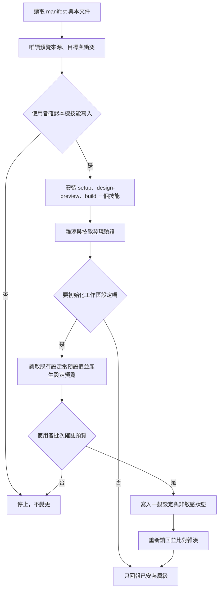

# 本機候選版安裝

目前安裝 `website-setup`、`website-design-preview` 與 `website-build` 三個技能。安裝管理器不連網、不登入 Cloudflare、不安裝 Node 套件，也不建立任何網站專案；起始範本留在技能包的 `template/`，由 `website-build` 在使用者確認後複製到指定目錄。



## 安裝前檢查

1. 閱讀 `AGENTS.md`、本文件、`install.manifest.toml` 與 `docs/verification-levels.md`。
2. 選擇明確的 Agent 技能目錄與位於技能掃描目錄外的狀態目錄。
3. 執行 `status` 做唯讀檢查，說明會新增的單一技能與所有同名衝突。
4. 取得使用者對「本機技能寫入」的明確確認後，才能執行 `install`。

範例路徑只使用佔位符：

```text
python3 scripts/manage_install.py status \
  --registration agents_workspace \
  --client-root <workspace>/.agents/skills \
  --state-root <local-state-root>
```

支援 `install`、`update`、`rollback`、`remove` 與 `status`。不同內容的同名入口、人工修改過的受管理技能、symlink 或損壞狀態一律停止；`remove` 只移至可回復隔離區。

## 工作區設定

`skills/website-setup/scripts/manage_workspace.py` 將預覽與寫入拆成兩個命令：

1. `preview` 驗證候選 JSON、列出差異並回傳預覽雜湊，不寫檔。
2. 使用者確認預覽後，`apply` 必須同時收到該雜湊與 `--confirm-write` 才能寫入。
3. 既有設定若在預覽後變動，雜湊會失效並停止。
4. 寫入後重新讀回；一般設定與非敏感狀態都明確標示不含憑證。

命令列旗標只是防誤用機制，不取代 Agent 在對話中取得使用者確認。

## 這個技能不做的事

安裝與設定技能不會安裝 Node.js、Astro 或 Wrangler。`website-build` 會在使用者確認計畫後建立專案並執行 `npm ci`（從 npm registry 下載 lockfile 鎖定的套件），但不會建立 Cloudflare 帳號、不會執行 `wrangler login`、不會部署、不會購買或綁定網域。這些屬於 `website-deploy` 的外部關卡，各自需要預覽、明確授權與讀回驗證；`website-deploy` 目前尚未建立。
