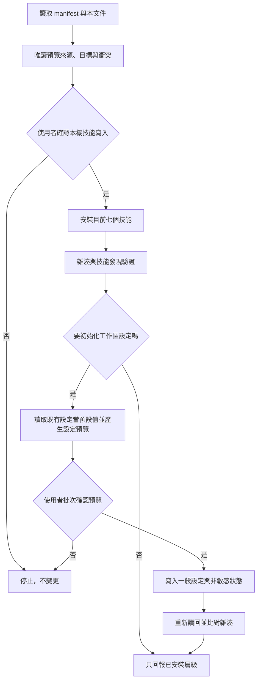

# 本機候選版安裝

目前安裝七個技能：`website-setup`、`website-content-writing`、`website-design-preview`、`website-build`、`website-deploy`、`website-service-integration` 與 `website-operations`。安裝管理器不連網、不登入 Cloudflare 或外部服務、不安裝 Node 套件、不建立網站專案，也不建立監控排程或備份。起始範本來源在技能包的 `template/`；manifest 指定將其完整複製至安裝後 `website-build/assets/template/`，與技能一起計算雜湊、更新、回復及可回復移除。畫廊讀取同層 website-build 的受管理範本，不依賴原下載位置或目前工作目錄。

舊版已安裝副本需先 status、預覽差異再明確 update；不要直接覆蓋私人已安裝檔。來源不同時 install 仍拒絕，人工修改過的技能或附帶範本都會擋下 update／remove。來源版維持根層 template 為唯一維護來源，不建立同步工具或 symlink；更新失敗會保留原副本。整個工作區搬移後 helper 的相對資產仍可用，但安裝狀態綁定原目標，須用新目標的正式 install/status 流程重新核對，不移植舊狀態假裝已驗證。



## 安裝前檢查

1. 閱讀 `AGENTS.md`、本文件、`install.manifest.toml` 與 `docs/verification-levels.md`。
2. 選擇明確的 Agent 技能目錄與位於技能掃描目錄外的狀態目錄。
3. 執行 `status` 做唯讀檢查，說明七個技能的新增／保留／衝突。
4. 取得使用者對「本機技能寫入」的明確確認後，才能執行 `install`。

範例路徑只使用佔位符：

```text
python3 scripts/manage_install.py status \
  --registration agents_workspace \
  --client-root <workspace>/.agents/skills \
  --state-root <local-state-root>
```

支援 `install`、`update-plan`、`update`、`rollback`、`remove`、`status`、`discover-state`、`migration-plan` 與 `migrate`。一般 install／update 不覆蓋衝突；人工修改過的受管理技能、symlink 或損壞狀態一律停止；`remove` 只移至可回復隔離區。

## 舊版五技能遷移

1. 不知道舊安裝狀態的位置時，以相同 registration／client-root 執行 `discover-state --search-root <明確指定的本機工具狀態父目錄>`，並指定擬用 state-root。只檢查該範圍的安裝登錄 JSON，不讀私人規則或 sync-manifest；找不到只代表指定範圍內沒有匹配，不代表整台電腦沒有。
2. 找到狀態時使用其 state-root 執行 status、update-plan；核准逐檔預覽後以相同參數執行 `update --expected-plan-sha256 <雜湊> --confirm-write`；多份匹配時停止，先選定正確登錄。不要以新 state-root 規避保護。舊狀態若包含快取雜湊而發生 drift，停止並個別核對，不自動重寫狀態。
3. 確認是沒有狀態的舊副本時，執行 `migration-plan`，沿用 status 的參數。預覽逐檔列出新增、改變、將移出使用中副本的檔案、舊版保留方式與 plan SHA-256；不寫檔。
4. 使用者確認該預覽後，才執行 `migrate --expected-plan-sha256 <同一份雜湊> --confirm-write`。預覽後來源或目標變動會停止；未列出的其他技能不受影響。
5. 舊副本以 `legacy-unmanaged` 保留在 state-root 的 snapshot；可用 `rollback` 還原，同時移除這次新增的技能入口。安裝失敗自動回復；若回復本身失敗，保留 transaction 並停止，勿刪除救援資料。
6. 重新 status 比對七技能全部雜湊，再做實際用戶端技能發現。

來源、複製與雜湊一致排除 `__pycache__`、`.pyc`、`.pyo`、`.pytest_cache`、`.git`、`node_modules`、`dist`、`.astro`。不需要先手動清除來源快取；執行測試也不應造成假更新。備份、隔離區與狀態放在技能掃描目錄外。

## 工作區設定

`skills/website-setup/scripts/manage_workspace.py` 將預覽與寫入拆成兩個命令：

1. `preview` 驗證候選 JSON、列出差異並回傳預覽雜湊，不寫檔。
2. 使用者確認預覽後，`apply` 必須同時收到該雜湊與 `--confirm-write` 才能寫入。
3. 既有設定若在預覽後變動，雜湊會失效並停止。
4. 寫入後重新讀回；一般設定與非敏感狀態都明確標示不含憑證。

命令列旗標只是防誤用機制，不取代 Agent 在對話中取得使用者確認。

## 這個技能不做的事

Windows 本機測試以目前 interpreter 啟動 Python 子程序；假 Wrangler 的 .py 腳本可位於中文／空白路徑。部署 helper 解析 npx.cmd 並保留 Windows 必要環境；本次僅驗證 npx／npm 自身版本命令，未取得真實 Wrangler 登入或部署證據。沒有 symlink 建立權限的測試只針對 WinError 1314 明確略過，仍須在具權限 runner 補驗；Node 真實建置須另啟用 WEBSITE_NODE_ACCEPTANCE，不以略過當成功。

安裝與設定技能不會安裝 Node.js、Astro 或 Wrangler。`website-build` 會在使用者確認計畫後建立專案並執行 `npm ci`（從 npm registry 下載 lockfile 鎖定的套件），但不會建立 Cloudflare 或外部服務帳號、不會登入、部署、購買網域或建立服務資源。Cloudflare 動作屬於 `website-deploy`；表單、電子報、預約與付款入口屬於 `website-service-integration`；健康檢查、備份、隔離復原與更新規劃屬於 `website-operations`。三者都維持預覽、明確授權與讀回邊界；目前真實 Cloudflare、服務帳號、公開監控、異地備份與線上回復尚未驗收。
